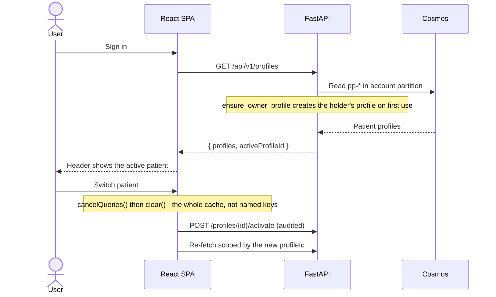
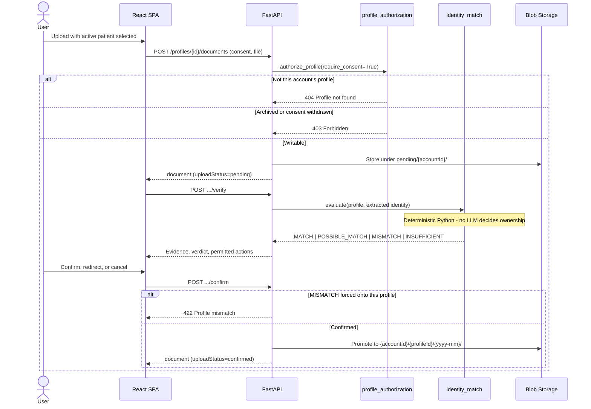
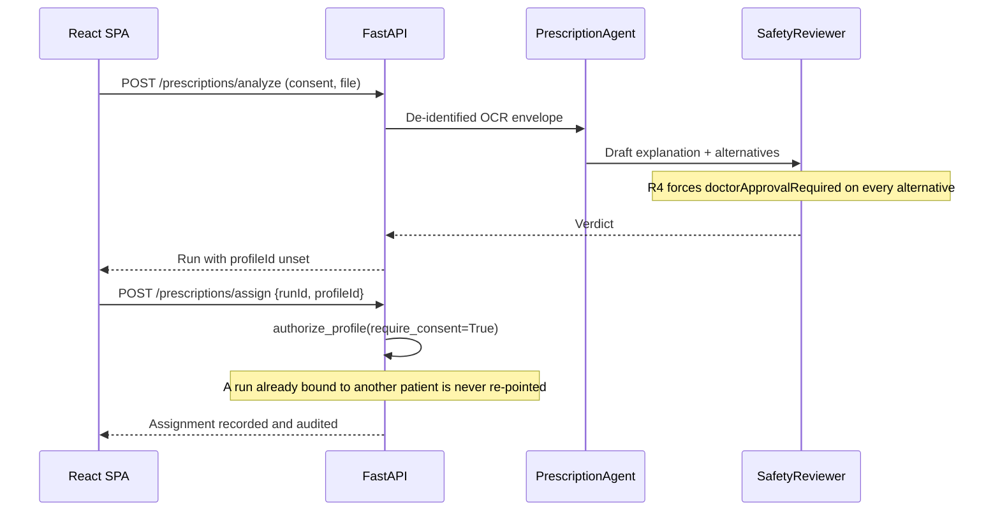
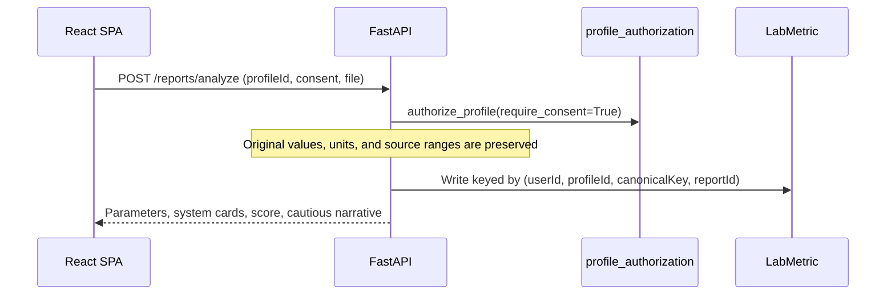
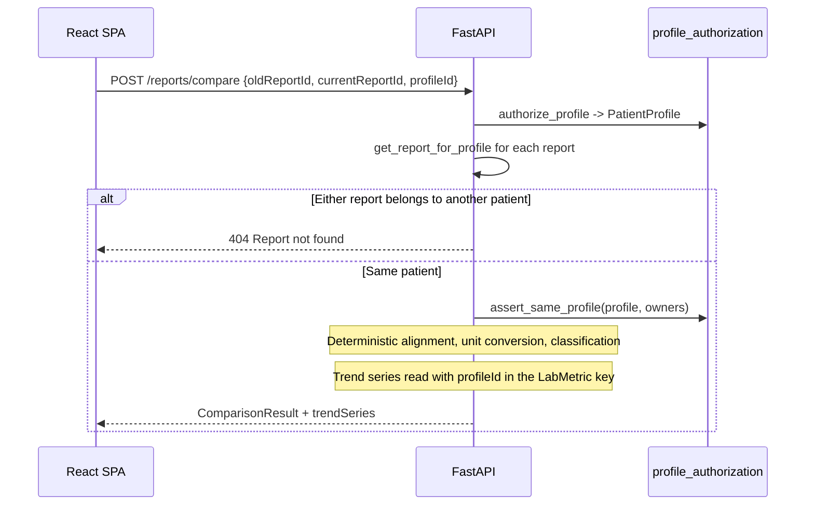
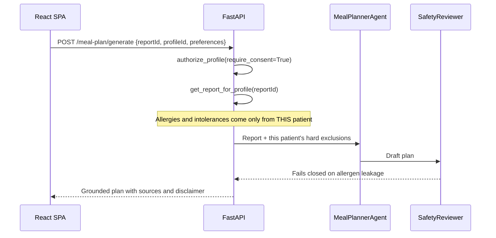

# health-iq-hackathon
This is a hackathon project solution for health iq project

## Documentation

- [Implementation plan](docs/implementation-plan.md)
- [Team plan](docs/team-plan.md)
- [Low level design](docs/lld/1-low-level-design-overview.md)

## Repository structure

```text
backend/    FastAPI service: app/{api,models,services,agents,rag,repositories}, tests/
frontend/   React + TypeScript SPA (Vite): src/{routes,features,components,lib}
data/       Seed CSV/JSON/MD sources for the medicine catalog, reference ranges,
            specialist mapping, nutrition rules, lab synonyms, and demo samples
infra/      Bicep IaC (see infra/README.md)
scripts/    seed_sql.py, build_search_indexes.py, run_local.ps1
docs/       Implementation plan, team plan, low-level design
```

Every backend/frontend folder already contains the scaffolding (package manifests, app factory,
router/model/service/agent stubs with `TODO` markers) described in
[`docs/implementation-plan.md`](docs/implementation-plan.md) Section 2, so each dev can start
adding code directly in their owned area per [`docs/team-plan.md`](docs/team-plan.md):

| Dev | Owns |
|-----|------|
| D1 - Platform/Ingestion | `infra/`, `backend/app/services/{ocr,blob,deidentify}.py`, `backend/app/deps.py` (Azure clients), observability wiring in `main.py` |
| D2 - Domain Data/RAG | `data/`, `backend/app/services/{normalize_medicine,normalize_lab,reference_ranges,comparison}.py`, `backend/app/rag/`, `backend/app/repositories/sql_repo.py` |
| D3 - Agents/Outputs | `backend/app/agents/` (incl. `prompts/*.md`), `backend/app/services/{pdf_builder,share_links}.py` |
| D4 - API/Frontend | `backend/app/{api,models}/`, `backend/app/repositories/cosmos_repo.py`, all of `frontend/` |

## Running locally

Prerequisites: [`uv`](https://docs.astral.sh/uv/) (Python 3.11), Node.js 20+, and the infra
provisioned per the section below (`.env` filled in from `.env.example`).

```powershell
cd backend; uv sync --extra dev; cd ..
cd frontend; npm install; cd ..
./scripts/run_local.ps1   # starts uvicorn (:8000) and vite (:5173) together
```

Or run each independently:
`uv run --project backend --directory backend uvicorn app.main:app --reload --reload-dir app` and
`npm --prefix frontend run dev`. Verify with `GET http://localhost:8000/health`.

With `DEMO_MODE=true` (the `.env.example` default) the app runs entirely on cached fixtures, so no
Azure resources are required to start the servers or run the test suite.

## Multi-patient profiles

One signed-in account manages many patients: themselves, a spouse, a child, a parent, a dependent,
or someone they are an authorized caregiver for. The account is only the authorization root - a
**patient profile** owns every medical artifact.

```text
Account -> PatientProfile -> MedicalDocument -> Analysis -> Comparison / MealPlan
```

### Profile isolation rules

Three rules hold on every patient-scoped request, and none of them involve an LLM:

1. The account id comes only from the validated session (`deps.get_current_user`). A caller may
   name a `profileId`; `accountId`/`userId`/`ownerId` sent by the browser are ignored.
2. Profiles are read from the caller's own Cosmos partition (`/userId` = account id), so another
   account's profile is unreachable by construction rather than filtered out afterwards.
3. "Does not exist" and "is not yours" both return **404**, so responses cannot be used to probe
   for someone else's data (insecure direct object reference defence).

Archived or consent-withdrawn profiles stay readable but refuse new processing with **403** - the
caller already proved ownership, so hiding the resource would be misleading.

`services/profile_authorization.py` is the single gate. Every patient-scoped handler resolves the
profile through it before touching a repository.

| Helper | Guarantees |
|--------|-----------|
| `authorize_profile(account_id, profile_id)` | Profile belongs to this account, else 404. `require_active=True` (default) rejects archived profiles with 403; `require_consent=True` rejects withdrawn consent with 403 |
| `authorize_document(account_id, profile, document_id)` | Document belongs to this account **and** this profile, else 404 |
| `assert_same_profile(profile, *owners)` | Rejects cross-profile combination (comparison) with 422 |

Repository reads are scoped too: `cosmos_repo.get_report_for_profile` and
`list_reports_for_profile` filter by the owning profile, and a report that fails the check raises
404 rather than 403.

### Storage scoping

| Store | Scoping |
|-------|---------|
| Cosmos `profiles` | Partition `/userId` = account id; patient docs use a `pp-` id prefix |
| Cosmos `documents` / `audit` / `consents` | Partition `/accountId`, filtered by `profileId` |
| Cosmos `reports` / `runs` | Partition by account, filtered by `profileId` |
| Azure SQL `LabMetric` | Keyed by `(userId, profileId, canonicalKey, reportId)` |
| Blob `raw-uploads` (pending) | Path `pending/{accountId}/{documentId}{ext}` - no profile yet |
| Blob `raw-uploads` (confirmed) | Path `{accountId}/{profileId}/{yyyy-mm}/{uuid}{ext}` |

The account holder's own profile is a **stored record** with `isAccountOwnerProfile=true` and a
`pp-` id of its own; it is created on first use by `patient_profiles.ensure_owner_profile`. A
report stored before patient profiles existed carries an empty `profileId` and resolves to that
owner profile, so history stays attributable without a migration.

### Profile API

| Method | Path | Purpose |
|--------|------|---------|
| `GET` | `/api/v1/profiles` | Switcher rows, account holder first, plus `activeProfileId` |
| `POST` | `/api/v1/profiles` | Add a family member or dependent (consent required) |
| `GET` | `/api/v1/profiles/{profileId}` | One patient's details |
| `PUT` | `/api/v1/profiles/{profileId}` | Edit patient-editable fields (optimistic concurrency) |
| `POST` | `/api/v1/profiles/{profileId}/archive` | Make read-only |
| `POST` | `/api/v1/profiles/{profileId}/restore` | Return an archived profile to active |
| `POST` | `/api/v1/profiles/{profileId}/consent/grant` | Grant consent |
| `POST` | `/api/v1/profiles/{profileId}/consent/withdraw` | Stop further processing |
| `POST` | `/api/v1/profiles/{profileId}/activate` | Record a profile switch (audited) |
| `GET` | `/api/v1/profiles/{profileId}/summary` | Artifact counts and newest score |
| `GET` | `/api/v1/profiles/{profileId}/history` | Report and document timeline |

### Document API

Uploads are quarantined and verified before they join a patient's history.

| Method | Path | Purpose |
|--------|------|---------|
| `POST` | `/api/v1/profiles/{profileId}/documents` | Park an upload as **pending** |
| `POST` | `.../documents/{documentId}/verify` | Extract identity, run the deterministic match |
| `POST` | `.../documents/{documentId}/confirm` | Bind, redirect to another profile, or reject |
| `GET` | `.../documents` / `.../documents/{documentId}` | Read this profile's documents |
| `DELETE` | `.../documents/{documentId}` | Delete the document and its blob |

Patient-scoped feature endpoints take the profile as `profileId` (multipart form field on upload
routes and JSON bodies) or `profile_id` (query string elsewhere): `reports/analyze`,
`GET reports`, `GET reports/{id}`, `reports/compare`, `prescriptions/assign`,
`meal-plan/generate`. Omitting it means the account holder's own profile.

### Profile-match workflow

`services/identity_match.py` decides, in plain Python, whether a document's identity is
consistent with the selected profile. An LLM writes the plain-language narrative *after* the
verdict is fixed (`agents/identity_agent.py`) and can never change it.

| Verdict | Meaning | Offered actions |
|---------|---------|-----------------|
| `MATCH` | Name agrees, date of birth corroborates or is absent | confirm, choose another, cancel |
| `POSSIBLE_MATCH` | Initials or partial name overlap only | confirm, choose another, create, cancel |
| `MISMATCH` | An identifier positively contradicts the profile | choose another, create, cancel |
| `INSUFFICIENT_IDENTITY_DATA` | Too little identity text to judge | explicit confirmation, choose, create, cancel |

A `MISMATCH` can never be forced onto the selected profile (422). An
`INSUFFICIENT_IDENTITY_DATA` document requires an explicit acknowledgement, which is recorded as
an audit event. Unconfirmed uploads expire after
`PENDING_UPLOAD_RETENTION_HOURS` (default 24).

### Sign-in and profile selection



### Document upload and identity verification



### Prescription analysis



### Lab-report analysis



### Report comparison



### Meal-plan generation



### Frontend behaviour

`ActiveProfileProvider` (`features/patient-profiles/`) holds the active patient and is consumed
through `useActiveProfile()`. The header renders `ProfileSelector`, which keeps the active patient
on the button face rather than inside the menu, so the person on screen is never in doubt.

On switch the provider cancels in-flight requests and **clears the entire** React Query cache
rather than removing a named list of keys - a list would silently stop covering any query added
later, which is exactly how one family member's data ends up on another's dashboard. The switch
is also reported to `POST /profiles/{id}/activate` so it is auditable; that call is made directly
rather than through a mutation, because `clear()` empties the mutation cache too.

A stored active-profile id is treated as untrusted input: it is only ever resolved against the
profile list the server returned for the current session, so a stale or foreign id falls back to
the account holder instead of being sent to the API.

### Tests

```powershell
cd backend; uv run pytest -q      # 293 tests
cd frontend; npm run test         # 38 tests
```

Isolation coverage lives in four files, all using synthetic data:

| File | Covers |
|------|--------|
| `backend/tests/unit/test_identity_match.py` | Normalization, date parsing, the four verdicts, determinism, OCR digit confusion |
| `backend/tests/integration/test_patient_profiles.py` | Owner-profile creation, multiple dependents, cross-account profile/document access, over-posting, upload/verify/confirm, mismatch refusal and redirection, insufficient-identity acknowledgement, duplicates, archive and consent gates, audit contents |
| `backend/tests/integration/test_profile_scoped_features.py` | Per-profile report lists and reads, cross-profile and cross-account comparison refusal, profile-scoped trend series, meal plans that use only the active patient's allergies |
| `frontend/src/features/patient-profiles/ActiveProfileContext.test.tsx` | Default profile, cache clearing on switch, audited switch, rejection of a foreign stored id |

## Provisioning the infrastructure

All Azure resources (Storage, Cosmos DB, Azure SQL, AI Search, Document Intelligence, Azure
OpenAI, Key Vault, Monitoring) are defined as Bicep in [`infra/`](infra/README.md). Local
development and the shared `dev` environment use the **same** provisioned resources - there is no
local emulator for Search/OpenAI/Document Intelligence, so `local` just means the app runs on your
machine while talking to those resources over the network.

### Prerequisites

- Azure CLI (`az login`) and Bicep CLI (`az bicep install`)
- Contributor + User Access Administrator (or Owner) on the target subscription/resource group
- Azure OpenAI access with `gpt-5.4` and `text-embedding-3-large` quota in the target region

### Provision for local development

```powershell
./infra/scripts/deploy.ps1 -Environment local -ResourceGroupName rg-healthiq-local -Location eastus2 -AutoFillDeveloperIdentity
```

This auto-fills your Entra object id and public IP into the deployment, grants your account
RBAC access to every resource, and writes all endpoints into Key Vault. Then copy `.env.example`
to `.env` and set `AZURE_KEY_VAULT_URI` to the deployment's `keyVaultUri` output - with `az login`
active, the backend authenticates via `DefaultAzureCredential` automatically (no keys needed).

### Provision for the shared dev environment

```powershell
./infra/scripts/deploy.ps1 -Environment dev -ResourceGroupName rg-healthiq-dev -Location eastus2
```

Fill in `infra/main.dev.parameters.json` first (SQL AAD admin group, etc.) and set
`deployContainerApps=true` once a backend/frontend container image exists to also provision
Container Apps hosting.

See [`infra/README.md`](infra/README.md) for the full resource list, RBAC model, SQL access
grants, and cost/teardown notes.
