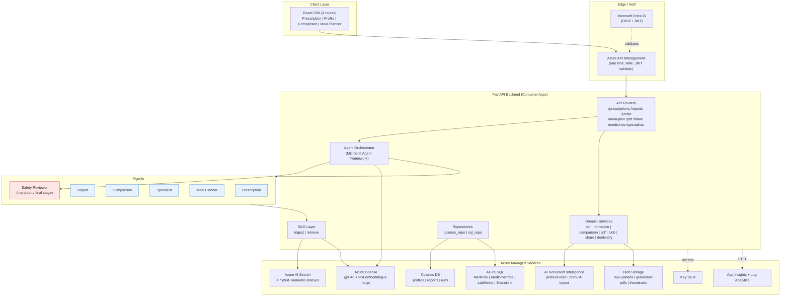

# Health IQ - Low Level Design (LLD)

This document is the authoritative Low Level Design for the Health IQ MVP. It is derived from `DesignDoc-V1` and `implementation-plan.md`, and is written to be **directly implementable** by the backend, frontend, infrastructure, and data teams.

The design is presented **feature-by-feature**. Section 0 (this document) establishes the shared platform context that every feature builds on (system topology, cross-cutting envelopes, auth, error model, safety pipeline). Each feature is documented in its own companion file with the full LLD template (Feature Overview through Recommendations). Section 7 consolidates cross-cutting security, observability, deployment, and risk views.

## Feature Index

| # | Feature / Workflow | Primary agent | Key endpoints | LLD file |
|---|--------------------|---------------|---------------|----------|
| 1 | Prescription & Medicine Analyzer | `PrescriptionAnalyzerAgent` | `POST /prescriptions/analyze`, `/prescriptions/confirm`, `/medicines/alternatives` | [2-low-level-design-prescription-medicine-analyzer.md](2-low-level-design-prescription-medicine-analyzer.md) |
| 2 | Health Profile & Specialist Advisor | `ReportAnalysisAgent`, `SpecialistAdvisorAgent` | `POST /reports/analyze`, `GET/PUT /profile`, `POST /specialists/suggest` | [3-low-level-design-health-profile-specialist-advisor.md](3-low-level-design-health-profile-specialist-advisor.md) |
| 3 | Report Comparison Engine | `ComparisonAgent` | `POST /reports/compare` | [4-low-level-design-report-comparison-engine.md](4-low-level-design-report-comparison-engine.md) |
| 4 | AI Meal Planner | `MealPlannerAgent` | `POST /meal-plan/generate` | [5-low-level-design-ai-meal-planner.md](5-low-level-design-ai-meal-planner.md) |
| 5 | Doctor-Review PDF & Secure Share | `pdf_builder` + `share_links` services | `POST /pdf/generate`, `GET /share/{shareId}` | [6-low-level-design-doctor-review-pdf-secure-share.md](6-low-level-design-doctor-review-pdf-secure-share.md) |
| 6 | Safety Reviewer & Orchestrator (cross-cutting) | `SafetyReviewerAgent`, `Orchestrator` | All (mandatory final stage) | [7-low-level-design-safety-reviewer-orchestrator.md](7-low-level-design-safety-reviewer-orchestrator.md) |
| 7 | Cross-Cutting Platform Design | - | Security, Observability, Deployment, Risks | [8-low-level-design-cross-cutting-platform.md](8-low-level-design-cross-cutting-platform.md) |

---

## 0. Shared Platform Context

### 0.1 System Topology



### 0.2 Global Design Decisions (justified)

| Decision | Choice | Justification |
|----------|--------|---------------|
| Backend framework | FastAPI (async) | Native async I/O for OCR/LLM/Search calls, OpenAPI generation for contract-first, first-class pydantic validation at boundaries. |
| Agent runtime | Microsoft Agent Framework `ChatAgent` per role | Deterministic tool routing, per-role guardrails, easy to unit test with recorded fixtures; matches design mandate. |
| Retrieval | Azure AI Search hybrid (BM25 + vector) + semantic ranker | Grounding is a safety requirement; hybrid recall + semantic precision reduces hallucination. |
| Identity to Azure | `DefaultAzureCredential` + managed identity | Zero secrets in code; RBAC least privilege; the security checklist mandates no connection strings. |
| Determinism boundary | Business classification in Python, LLM only writes narrative | Patient-safety: numeric verdicts (savings %, improved/worsened) must be reproducible and testable, not model-generated. |
| Response envelope | Uniform `{ requestId, generatedAt, disclaimer, safety }` | Auditability + consistent client handling + enforced safety surface. |
| Error format | RFC 7807 Problem Details | Standard machine-readable errors across all endpoints. |

### 0.3 Cross-Cutting Response Envelope

Every successful `2xx` JSON response embeds this envelope. Feature-specific payload is placed under `data`.

```json
{
  "requestId": "req-8f3c2b1a-...",
  "generatedAt": "2026-08-27T10:15:03.221Z",
  "apiVersion": "v1",
  "disclaimer": "This is a health information and doctor-collaboration assistant. It does not diagnose, prescribe, or replace clinical judgment. Any medicine alternative or health action must be reviewed by a qualified healthcare professional.",
  "safety": {
    "pass": true,
    "notes": [],
    "reviewerVersion": "safety-1.0.0"
  },
  "data": { }
}
```

### 0.4 Global Error Model (RFC 7807)

```json
{
  "type": "https://healthiq/errors/low-confidence-ocr",
  "title": "OCR confidence below threshold",
  "status": 422,
  "detail": "3 tokens fell below the 0.75 confidence gate and require user confirmation.",
  "instance": "/api/v1/prescriptions/analyze",
  "requestId": "req-8f3c2b1a-...",
  "errors": [
    { "field": "items[1].brandName", "issue": "confidence 0.61 < 0.75" }
  ]
}
```

| Category | HTTP | `type` slug | Example trigger |
|----------|------|-------------|-----------------|
| Validation | 400 | `validation-error` | Missing `consent=true`, malformed JSON |
| Auth | 401 | `unauthenticated` | Missing/expired Entra JWT |
| Authorization | 403 | `forbidden` | User accessing another user's `reportId` |
| Not found | 404 | `resource-not-found` | Unknown `runId` / `shareId` |
| Unsupported media | 415 | `unsupported-media-type` | MIME/magic-byte mismatch |
| Business rule | 422 | `low-confidence-ocr`, `no-safe-alternative` | Confidence gate, no valid match |
| Rate limit | 429 | `rate-limited` | Share link abuse |
| Safety block | 422 | `safety-violation` | SafetyReviewer hard fail (R3-R6) |
| Upstream failure | 502 | `upstream-unavailable` | Document Intelligence / OpenAI outage |
| Timeout | 504 | `upstream-timeout` | OCR/LLM exceeds budget |

### 0.5 Authentication & Authorization (applies to all features)

- **AuthN**: Microsoft Entra ID OIDC. The React SPA acquires a token via MSAL; APIM validates the JWT (issuer, audience, expiry, signature) before forwarding. Local dev uses a stub user (`x-debug-user` header honored **only** when `ENV=local`).
- **AuthZ**: Every persisted entity is partitioned by `userId` (Entra `oid`). Repositories enforce `WHERE userId = :caller`; cross-user access returns `403`.
- **Service-to-Azure**: Managed identity + `DefaultAzureCredential`; RBAC role assignments per resource (see 7.1). No account keys or connection strings in app config.

### 0.6 Mandatory Safety Pipeline

`SafetyReviewerAgent` runs as the final stage of **every** user-facing payload (see Feature 6). No router returns `data` that has not passed through it. This is a platform invariant, not a per-feature option.

---
