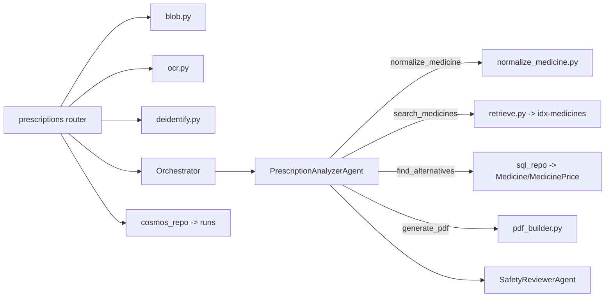
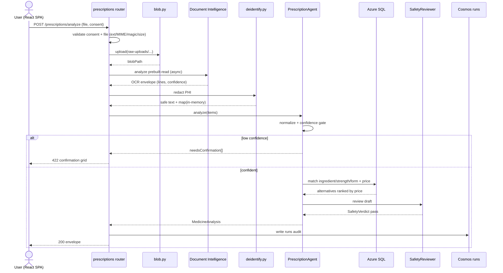

# Feature 1 - Prescription & Medicine Analyzer

## 1.1 Feature Overview

- **Feature Name**: Prescription & Medicine Analyzer
- **Business Purpose**: Convert a prescription or tablet-strip image into structured medicine entities, then surface doctor-reviewable generic and cheaper equivalents with provenance and estimated savings, and produce a doctor-review PDF. Helps patients understand prescriptions and identify affordability options without ever changing therapy autonomously.

### Functional Requirements

| ID | Requirement |
|----|-------------|
| FR1.1 | Accept upload of prescription image/PDF, tablet-strip image, or manual medicine entry. |
| FR1.2 | Extract medicine text, dosage, frequency, and notes via Document Intelligence `prebuilt-read`. |
| FR1.3 | Normalize each entity to `{ brandName, activeIngredient, strength, dosageForm, frequency, duration }`. |
| FR1.4 | Flag any token with OCR confidence `< 0.75`; block alternatives until user confirms/corrects. |
| FR1.5 | Return alternatives only when active-ingredient set, strength, and dosage form match exactly and source is `<= 24 months` old. |
| FR1.6 | Compute `savingsPct` deterministically; label as estimated with source date. |
| FR1.7 | Mark every alternative `doctorApprovalRequired=true`. |
| FR1.8 | Generate a doctor-review PDF and a secure, revocable share link (delegated to Feature 5). |

### Non-Functional Requirements

| ID | Requirement | Target |
|----|-------------|--------|
| NFR1.1 | Prescription flow p95 latency | < 12 s |
| NFR1.2 | Upload size cap | 10 MB; allowlist `.jpg/.jpeg/.png/.pdf/.heic` |
| NFR1.3 | PHI minimization | De-identify before any LLM call |
| NFR1.4 | Grounding | Every alternative claim carries `sourceUrl` + `sourceDate` |
| NFR1.5 | Determinism | Savings math + match rules reproducible in unit tests |
| NFR1.6 | Availability | Degrades to manual-entry path if OCR upstream down |

### Assumptions

- A1: Medicine catalog (`Medicine` + `MedicinePrice`) is curated demo data seeded to Azure SQL and indexed to `idx-medicines`.
- A2: `DEMO_MODE=true` replays cached OCR to avoid live-demo flakiness.
- A3: Combination drugs require exact multiset match of ingredients or are excluded.
- A4: Prices are MRP in INR; savings are indicative only.
- A5: One prescription upload maps to one `runId` used through PDF generation.

### Dependencies

- Azure AI Document Intelligence (`prebuilt-read`), Azure OpenAI (`gpt-4o`), Azure AI Search (`idx-medicines`), Blob Storage (`raw-uploads`), Azure SQL (`Medicine`, `MedicinePrice`), Cosmos DB (`runs`), Key Vault, App Insights.
- Services: `blob.py`, `ocr.py`, `deidentify.py`, `normalize_medicine.py`, `reference_ranges.py`, `pdf_builder.py`.

## 1.2 Architecture Design

### Component Diagram Description

The router `api/prescriptions.py` receives the multipart upload, invokes `blob.upload()` (validation + storage), `ocr.extract_read()` (OCR envelope), and `deidentify.redact()` before handing control to the `PrescriptionAnalyzerAgent` via the orchestrator. The agent calls tools: `ocr_extract` -> `normalize_medicine` -> `search_medicines` -> `find_alternatives` -> `generate_pdf`. `find_alternatives` uses deterministic Python (`normalize_medicine.py` + `sql_repo`) for match/savings; the LLM only writes the plain-language wrapper. `SafetyReviewerAgent` validates the draft before response.

### Service Interactions



### Sequence of Operations

1. Validate consent + file (extension, MIME, magic bytes, size).
2. Store raw file at `raw-uploads/{userId}/{yyyy-mm}/{uuid}{ext}`; persist consent + blob metadata.
3. OCR via `prebuilt-read`; build envelope with per-line confidence + `handwrittenRatio`.
4. De-identify OCR text (name, phone, email, MRN, address) before LLM.
5. Normalize each medicine line; compute `matchScore`, set `needsUserConfirmation` if `< 0.75` or match band `75-87`.
6. If any `needsUserConfirmation`, return `422`/confirmation payload; else proceed.
7. `find_alternatives` deterministically; rank by price ascending; compute savings.
8. Draft `MedicineAnalysis`; `SafetyReviewerAgent` enforces R1-R5.
9. Persist `runs` audit doc; return envelope.

### Data Flow

`image/pdf` → Blob (raw) → OCR envelope (JSON) → de-identified text → `MedicineEntity[]` → catalog match (SQL/Search) → `Alternative[]` → `MedicineAnalysis` → SafetyVerdict → response + `runs` audit.

### Integration Points & External Systems

- **Document Intelligence**: async analyze + poll (`prebuilt-read`).
- **Azure OpenAI**: entity cleanup narrative + safety review.
- **Azure AI Search**: composition/alternative recall.
- **Azure SQL**: authoritative match on `(ActiveIngredient, StrengthValue, StrengthUnit, DosageForm)` + price join.

## 1.3 API Design

### 1.3.1 POST /api/v1/prescriptions/analyze

#### Endpoint Details

| Attribute | Value |
|-----------|-------|
| Endpoint Name | Analyze Prescription |
| URL | `/api/v1/prescriptions/analyze` |
| HTTP Method | `POST` (multipart/form-data) |
| Auth | Entra JWT required; scope `HealthIQ.Prescriptions.Write` |
| Request Headers | `Authorization: Bearer <jwt>`, `Content-Type: multipart/form-data`, `X-Request-Id` (optional), `Idempotency-Key` (optional) |
| Query Parameters | none |
| Path Parameters | none |
| Form fields | `file` (binary, required), `consent` (bool, required `true`), `manualMedicines` (JSON string, optional) |
| Idempotency | `Idempotency-Key` header dedupes retries for 24 h (keyed to `userId+key+bodyHash`); same key returns the original `runId`. |
| Rate limits | 30 req/min/user at APIM |

##### Request Payload Schema (form)

```
file:            <binary>                 # required, <=10MB, allowlisted
consent:         true                     # required
manualMedicines: [{"rawText":"Amlodipine 5mg 0-0-1"}]   # optional
```

##### Response Payload Schema (200) - `data`

```json
{
  "runId": "run-2f1c...",
  "blobPath": "raw-uploads/oid-123/2026-08/2f1c.pdf",
  "ocrConfidence": 0.91,
  "handwrittenRatio": 0.04,
  "items": [
    {
      "lineId": "li-1",
      "rawText": "Brand A 500mg 1-0-1 x5d",
      "brandName": "Brand A",
      "activeIngredient": ["Active ingredient X"],
      "strengthValue": 500, "strengthUnit": "mg",
      "dosageForm": "tablet",
      "frequency": "1-0-1", "duration": "5 days",
      "matchScore": 0.94,
      "ocrConfidence": 0.88,
      "needsUserConfirmation": false
    }
  ],
  "needsConfirmation": [],
  "disclaimers": ["Doctor review required before any medicine change."]
}
```

##### Error Responses & Status Codes

| Status | Type | Condition |
|--------|------|-----------|
| 200 | - | Analysis complete |
| 400 | `validation-error` | `consent != true`, no file |
| 415 | `unsupported-media-type` | MIME/magic-byte mismatch |
| 413 | `payload-too-large` | > 10 MB |
| 422 | `low-confidence-ocr` | Tokens below gate; `needsConfirmation` populated |
| 502 | `upstream-unavailable` | Document Intelligence down (offer manual path) |
| 504 | `upstream-timeout` | OCR > 60 s |

#### API Interaction Flow

- **Caller**: React Prescription route.
- **Target**: `prescriptions` router → orchestrator → `PrescriptionAnalyzerAgent`.
- **Validation**: consent, file safety, size; per-token confidence gate.
- **Business logic**: OCR → de-identify → normalize → (conditional) confirm gate.
- **Downstream**: Document Intelligence, Search, SQL, Blob, Cosmos `runs`.
- **Response handling**: uniform envelope; confirmation branch on low confidence.
- **Retry strategy**: OCR poll with exponential backoff (0.5s→8s, max 60s); 3 attempts on 5xx.
- **Failure handling**: On upstream OCR failure return `502` with `manualEntryAvailable=true`.

### 1.3.2 POST /api/v1/prescriptions/confirm

| Attribute | Value |
|-----------|-------|
| URL | `/api/v1/prescriptions/confirm` |
| Method | `POST` (application/json) |
| Auth | Entra JWT; `HealthIQ.Prescriptions.Write` |
| Idempotency | Natural: same `{runId, corrections}` yields same corrected items. |

Request:

```json
{ "runId": "run-2f1c...", "corrections": [ { "lineId": "li-1", "brandName": "Brand A", "strengthValue": 500, "strengthUnit": "mg", "dosageForm": "tablet" } ] }
```

Response `data`: updated `items[]` with recomputed `matchScore`, `needsUserConfirmation=false`.

Errors: `404 resource-not-found` (unknown `runId`), `403 forbidden` (run owned by other user), `400 validation-error`.

### 1.3.3 POST /api/v1/medicines/alternatives

| Attribute | Value |
|-----------|-------|
| URL | `/api/v1/medicines/alternatives` |
| Method | `POST` (application/json) |
| Auth | Entra JWT; `HealthIQ.Medicines.Read` |
| Idempotency | Pure function of `items[]`; safe to retry. |
| Rate limits | 60 req/min/user |

Request:

```json
{ "items": [ { "activeIngredient": ["Active ingredient X"], "strengthValue": 500, "strengthUnit": "mg", "dosageForm": "tablet", "brandName": "Brand A" } ] }
```

Response `data`:

```json
{
  "alternatives": [
    {
      "original": "Brand A 500 mg",
      "generic": "Generic X 500 mg",
      "cheaper": "Manufacturer B X 500 mg",
      "originalMrpInr": 42.00,
      "cheaperMrpInr": 23.10,
      "savingsPct": 45,
      "savingsEstimated": true,
      "source": { "name": "NPPA", "url": "https://...", "date": "2026-06-01" },
      "doctorApprovalRequired": true,
      "matchBasis": "exact-ingredient-strength-form"
    }
  ],
  "unmatched": []
}
```

Errors: `422 no-safe-alternative` (no record satisfies hard constraints), `400 validation-error`.

## 1.4 Data Design

### Tables / Collections

- **Azure SQL** `Medicine`, `MedicinePrice` (source of truth for match + price).
- **Azure AI Search** `idx-medicines` (recall/fuzzy composition lookup).
- **Cosmos DB** `runs` (pk `/userId`) - audit of each analysis.

### Entity Relationship Description

`Medicine 1..* MedicinePrice` (one medicine, many priced sources). A `run` references a `blobPath` and captures the resolved `items[]` + `alternatives[]` snapshot for audit.

### Schema Definition (authoritative match index)

```sql
CREATE INDEX IX_Medicine_Match
  ON Medicine(ActiveIngredient, StrengthValue, StrengthUnit, DosageForm);
```

`runs` document:

```json
{
  "id": "run-2f1c...",
  "userId": "oid-123",
  "type": "prescription",
  "inputHash": "sha256:...",
  "blobPath": "raw-uploads/oid-123/2026-08/2f1c.pdf",
  "toolCalls": ["ocr_extract","normalize_medicine","find_alternatives","generate_pdf"],
  "agentVersions": { "prescription": "1.0.0", "safety": "1.0.0" },
  "safety": { "pass": true, "violations": [] },
  "createdAt": "2026-08-27T10:15:03Z"
}
```

### Indexing Strategy

- SQL composite index `IX_Medicine_Match` drives O(log n) exact-match lookups.
- Search HNSW vector profile + semantic config for fuzzy/brand recall.

### Data Retention

- Raw uploads: lifecycle rule deletes blobs after 7 days (MVP).
- `runs`: retained for demo window then purged post-hackathon.

### Migration Requirements

- `scripts/seed_sql.py` seeds 60-80 `Medicine` rows + prices from `data/medicines/medicine_catalog.csv`.
- `scripts/build_search_indexes.py` populates `idx-medicines` (idempotent, deterministic doc IDs `sha1(source+row_key)`).

## 1.5 Event-Driven Design

MVP is request/response; no message broker. Audit "events" are synchronous writes to `runs`. Emitted telemetry events (App Insights custom events): `PrescriptionAnalyzed`, `LowConfidenceGate`, `AlternativeMatched`, `SafetyBlocked`. Retry for telemetry is handled by the OTEL exporter buffer; dropped telemetry never blocks the user response. (Phase 2 candidate: publish `PrescriptionAnalyzed` to Event Grid for async PDF pre-generation with a dead-letter queue.)

## 1.6 Security Design

- **AuthN/AuthZ**: as 0.5; `runId`/`blobPath` scoped to `userId`.
- **RBAC data roles**: backend MI holds `Storage Blob Data Contributor` (scoped container), `Search Index Data Reader`, SQL `db_datareader`+scoped writer, Cosmos data contributor.
- **Encryption**: at rest (Storage/SQL/Cosmos), TLS 1.2+ in transit.
- **Secrets**: Key Vault references; no keys in code.
- **Injection defense**: OCR text is untrusted; wrapped in delimiters and passed as data, never instructions to the LLM.
- **Upload safety**: extension + MIME + magic-byte checks, 10 MB cap, reject archives/SVG.
- **Audit logging**: `runs` records input hash, tool calls, agent versions, safety verdict.

## 1.7 Observability

- **Logs**: structured JSON with `requestId`, `runId`, `userIdHash`; OCR request/response sizes (no PHI content).
- **Metrics**: `ocr_confidence` (histogram), `agent_latency_ms{agent=prescription}`, `alternative_match_rate`, `safety_block_count`, `pdf_success_rate`.
- **Dashboards**: prescription funnel (upload→OCR→confirm→alternatives→PDF), OCR confidence distribution.
- **Alerts**: OCR failure spike, p95 > 12 s, safety block rate anomaly.
- **Tracing**: OTEL spans `blob.upload`, `ocr.read`, `deidentify`, `agent.prescription.turn`, `sql.match`, `pdf.build`.

## 1.8 Scalability & Performance

- **Expected load (MVP/demo)**: < 5 concurrent users; design headroom to 50 rps.
- **Caching**: cache catalog match results by `(ingredientSet,strength,form)` in-process LRU (TTL 10 min); `DEMO_MODE` caches OCR envelopes on blob hash.
- **Scaling**: Container Apps horizontal autoscale on concurrency; OCR/LLM are the bottlenecks - use async + connection pooling.
- **Bottlenecks**: Document Intelligence latency, OpenAI TPM limits.
- **Optimizations**: batch embeddings, precomputed catalog vectors, short prompts, deterministic Python for math.

## 1.9 Error Handling

| Class | Handling |
|-------|----------|
| Functional (low confidence) | Return `422` + `needsConfirmation`; UI forces correction grid. |
| Functional (no alternative) | `422 no-safe-alternative`; show "no equivalent meets safety rules". |
| System (OCR/LLM 5xx) | Retry w/ backoff; fall back to manual entry. |
| Timeout | 60 s OCR budget; 30 s LLM budget → `504`. |
| Fallback | Manual medicine entry path bypasses OCR entirely. |

## 1.10 Sequence Diagram



## 1.11 Detailed Processing Flow

1. Client POSTs multipart with `consent=true`.
2. Router rejects if consent missing (`400`).
3. `blob.upload` sniffs content-type, checks magic bytes + size, writes to `raw-uploads/{userId}/{yyyy-mm}/{uuid}{ext}`, sets consent metadata.
4. Persist consent (`consentVersion/At/purpose`) to `profiles`.
5. `ocr.extract_read` submits async analyze, polls with backoff (timeout 60 s), returns `{pages, lines[{text,confidence,bbox}], tables, handwrittenRatio}`.
6. `deidentify.redact` removes PHI before any LLM call (reversible map in-memory only).
7. `normalize_medicine`: strip dosage tokens (`1-0-1/BD/OD/HS/SOS`), regex strength `(\d+(?:\.\d+)?)\s*(mg|mcg|g|ml|iu|%)`, fuzzy `token_set_ratio` (≥88 accept, 75-87 review, <75 reject), emit `MedicineEntity`.
8. If any `needsUserConfirmation` → return confirmation payload; user calls `/confirm`.
9. `find_alternatives`: SQL exact match on ingredient set + strength + form, source `<=24 months`, exclude combinations without multiset match; rank price ascending; `savingsPct = round((orig-alt)/orig*100)`.
10. Draft `MedicineAnalysis{items, alternatives, disclaimers, confidence}`.
11. `SafetyReviewerAgent` enforces R1-R5; on fail return redacted payload + `safety`.
12. Write `runs` audit; return envelope. PDF generation is a separate call (Feature 5).

## 1.12 Open Questions / Risks

- **Technical risks**: handwriting OCR accuracy; brand-name ambiguity across manufacturers; stale prices.
- **Design gaps**: HEIC decoding on server; multi-page prescription handling; combination-drug canonical ordering.
- **Assumptions needing validation**: catalog coverage for demo prescriptions; source freshness window (24 months) acceptable to judges.

## 1.13 Recommendations

- **Best practices**: contract-first OpenAPI, deterministic match unit tests, fixture-based agent tests.
- **Security**: per-row OCR confidence surfaced in PDF; keep de-identification map out of persistence.
- **Performance**: precompute catalog embeddings; cache match results; use `DEMO_MODE` for demos.
- **Future**: openFDA/NPPA live price sync (Phase 2); drug-interaction checks (with clinical validation); multilingual OCR.

---
