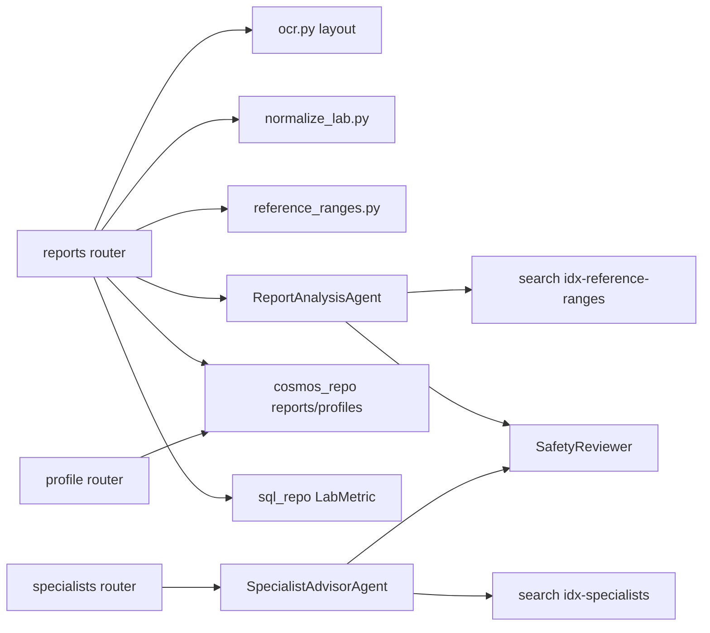
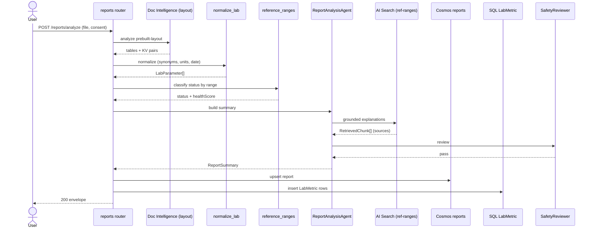

# Feature 2 - Health Profile & Specialist Advisor

This feature combines two tightly coupled workflows: **Report Analysis** (turning a lab report into a visual health snapshot) and **Specialist Advisor** (mapping abnormal parameters to specialist categories). Both share the profile/history store.

## 2.1 Feature Overview

- **Feature Name**: Health Profile & Specialist Advisor
- **Business Purpose**: Maintain a logged-in patient profile with report history, analyze the latest lab report into an understandable visual snapshot (health score, organ/system cards, abnormal flags), and suggest which specialist category to discuss with - always in safe, non-diagnostic language.

### Functional Requirements

| ID | Requirement |
|----|-------------|
| FR2.1 | Analyze uploaded lab report via `prebuilt-layout` (tables/KV pairs). |
| FR2.2 | Normalize parameters to canonical keys with unit conversion and reference-range status. |
| FR2.3 | Compute a health score and per-system cards with risk chips. |
| FR2.4 | Persist report + parameters to Cosmos `reports` and metrics to SQL `LabMetric`. |
| FR2.5 | Return/maintain profile (`GET/PUT /profile`) including consent, preferences, history. |
| FR2.6 | Map abnormal parameter groups to specialist categories with rationale and public/demo doctor links. |
| FR2.7 | Use safe language ("possible concern"); never name a disease or assert urgency. |

### Non-Functional Requirements

| ID | Requirement | Target |
|----|-------------|--------|
| NFR2.1 | Report analysis p95 | < 15 s |
| NFR2.2 | Every explanation carries `sourceUrl` + `sourceDate` | 100% |
| NFR2.3 | Deterministic status classification (low/normal/high/critical_flag) | reproducible |
| NFR2.4 | PHI minimization before LLM | enforced |
| NFR2.5 | Health score reproducibility | pure function of parameters |

### Assumptions

- A1: Canonical parameter set is fixed for MVP (17 parameters listed in plan §2.4).
- A2: Reference ranges are educational, keyed by `(canonicalKey, sex, ageBand)`.
- A3: Specialist mapping is curated (`data/specialists/specialist_mapping.csv` → `idx-specialists`).
- A4: Doctor links are public/demo data; no endorsement implied.
- A5: Health score is a transparent rule-based composite (0-100), not an ML model.

### Dependencies

- Document Intelligence (`prebuilt-layout`), Azure OpenAI, Azure AI Search (`idx-reference-ranges`, `idx-specialists`), Cosmos DB (`profiles`, `reports`), Azure SQL (`LabMetric`), Blob (`raw-uploads`), `reference_ranges.py`, `normalize_lab.py`, `deidentify.py`.

## 2.2 Architecture Design

### Component Diagram Description

`api/reports.py` handles `/reports/analyze`; `api/profile.py` handles `GET/PUT /profile`; `api/specialists.py` handles `/specialists/suggest`. `ReportAnalysisAgent` orchestrates `ocr_layout → normalize_lab → lookup_reference_range → search_reference_explanations`. Deterministic status + health score are computed in Python (`reference_ranges.py`); the LLM writes only the narrative. `SpecialistAdvisorAgent` consumes stored abnormal parameters and queries `idx-specialists`.

### Service Interactions



### Sequence of Operations (report analyze)

1. Validate + store report; OCR layout (tables/KV).
2. De-identify → normalize parameters (synonyms, units, dates).
3. Look up reference ranges by `(key, sex, ageBand)`; classify status.
4. Compute health score + system cards (Python).
5. RAG-fetch patient-friendly explanations (grounded).
6. Persist `reports` doc + `LabMetric` rows.
7. Safety review → response.

### Data Flow

`report file` → Blob → layout OCR → `LabParameter[]` → status/score → grounded explanations → `ReportSummary` → persist (Cosmos `reports`, SQL `LabMetric`).

### Integration Points & External Systems

- Document Intelligence `prebuilt-layout` (table extraction).
- Search `idx-reference-ranges` (explanations), `idx-specialists` (mapping).
- Cosmos `profiles`/`reports`; SQL `LabMetric` (trend source for Feature 3).

## 2.3 API Design

### 2.3.1 POST /api/v1/reports/analyze

| Attribute | Value |
|-----------|-------|
| URL | `/api/v1/reports/analyze` |
| Method | `POST` multipart |
| Auth | Entra JWT; `HealthIQ.Reports.Write` |
| Form fields | `file` (binary, required), `consent` (bool, required), `reportDate` (ISO date, optional) |
| Idempotency | `Idempotency-Key` dedupes; same file hash returns same `reportId` |
| Rate limits | 30 req/min/user |

Response `data`:

```json
{
  "reportId": "report-9ab...",
  "reportDate": "2026-06-14",
  "reportType": "lab-panel",
  "healthScore": 68,
  "parameters": [
    { "canonicalKey": "hba1c", "displayName": "HbA1c", "value": 7.4, "unit": "%",
      "refLow": 4.0, "refHigh": 5.6, "status": "high", "sourceConfidence": 0.96,
      "explanation": "HbA1c reflects average blood sugar over ~3 months.",
      "source": { "name": "Curated ref ranges", "url": "https://...", "date": "2026-05-01" } }
  ],
  "abnormal": [ { "canonicalKey": "hba1c", "status": "high" } ],
  "systemCards": [ { "system": "metabolic", "risk": "elevated", "parameters": ["hba1c","glucose_fasting"] } ],
  "narrative": "Some metabolic markers are above the typical range and may be worth discussing with a doctor."
}
```

Errors: `422 low-confidence-ocr`, `415 unsupported-media-type`, `413 payload-too-large`, `502/504` upstream.

#### API Interaction Flow

- **Caller**: Profile / Comparison tabs.
- **Validation**: consent, file safety, parameter confidence.
- **Business logic**: normalize → classify → score → ground explanation.
- **Downstream**: Document Intelligence, Search, Cosmos, SQL.
- **Retry**: OCR backoff; Search 2 retries.
- **Failure**: partial parameters returned with `partial=true` if some rows unparseable.

### 2.3.2 GET /api/v1/profile

| Attribute | Value |
|-----------|-------|
| URL | `/api/v1/profile` |
| Method | `GET` |
| Auth | Entra JWT; `HealthIQ.Profile.Read` |
| Idempotency | Safe (read-only) |

Response `data`:

```json
{
  "profile": {
    "demographics": { "ageBand": "35-44", "sex": "F", "location": "Bengaluru" },
    "consent": { "version": "1.0", "acceptedAt": "2026-08-27T10:00:00Z", "purposes": ["ocr","analysis","pdf"] },
    "preferences": { "allergies": ["peanut"], "cuisine": "south-indian-veg", "budget": "low", "goals": ["reduce-hba1c"] }
  },
  "reports": [ { "reportId": "report-9ab...", "reportDate": "2026-06-14", "healthScore": 68 } ],
  "latestSummary": { "reportId": "report-9ab...", "healthScore": 68 }
}
```

### 2.3.3 PUT /api/v1/profile/preferences

| Attribute | Value |
|-----------|-------|
| URL | `/api/v1/profile/preferences` |
| Method | `PUT` |
| Auth | Entra JWT; `HealthIQ.Profile.Write` |
| Idempotency | Full-resource PUT is idempotent |

Request:

```json
{ "allergies": ["peanut","shellfish"], "cuisine": "south-indian-veg", "goals": ["reduce-hba1c"], "location": "Bengaluru", "budget": "low" }
```

Response `data`: updated `profile`. Errors: `400 validation-error` (unknown allergen token), `409 conflict` (stale `etag` optimistic concurrency).

### 2.3.4 POST /api/v1/specialists/suggest

| Attribute | Value |
|-----------|-------|
| URL | `/api/v1/specialists/suggest` |
| Method | `POST` |
| Auth | Entra JWT; `HealthIQ.Reports.Read` |
| Idempotency | Pure function of report abnormal set |

Request: `{ "reportId": "report-9ab..." }`

Response `data`:

```json
{
  "categories": [
    { "specialtyCategory": "diabetologist", "parameterGroup": "metabolic",
      "whenToConsult": "Discuss elevated HbA1c/glucose trends.", "confidence": 0.82 }
  ],
  "rationale": "HbA1c and fasting glucose are above the typical range.",
  "doctorLinks": [ { "name": "Public directory", "url": "https://...", "provenance": "public/demo" } ],
  "disclaimer": "Specialist category suggestion only; not a diagnosis or urgency claim."
}
```

Errors: `404 resource-not-found` (report), `422` (no abnormal parameters → returns empty categories + general-physician note).

## 2.4 Data Design

### Tables / Collections

- Cosmos `profiles` (pk `/userId`), `reports` (pk `/userId`).
- SQL `LabMetric` (trend metrics), index `IX_LabMetric_Trend(UserId, CanonicalKey, ReportDate)`.
- Search `idx-reference-ranges`, `idx-specialists`.

### Entity Relationship Description

`profile 1..* reports`; each `report` fans out to many `LabMetric` rows (one per canonical parameter). `reports.latestSummaryId` points to the newest analyzed report.

### Schema Definition

`reports` doc and `LabMetric` DDL are per implementation plan §4.2 / §4.3. `profiles` uses optimistic concurrency via Cosmos `_etag`.

### Indexing Strategy

- Cosmos default indexing on `/reportDate`, `/parameters/canonicalKey`.
- SQL trend index accelerates Feature 3 comparison queries.

### Data Retention

- Reports retained for demo; blobs purged at 7 days. `LabMetric` purged post-hackathon.

### Migration Requirements

- Seed `idx-reference-ranges` from `lab_reference_ranges.csv`, `idx-specialists` from `specialist_mapping.csv`.

## 2.5 Event-Driven Design

Request/response for MVP. Telemetry events: `ReportAnalyzed`, `AbnormalDetected`, `SpecialistSuggested`, `HealthScoreComputed`. Phase 2: publish `ReportAnalyzed` to Event Grid to trigger async meal-plan refresh; DLQ on subscriber failure with 3 retries.

## 2.6 Security Design

- AuthZ: `reportId`/`profile` strictly scoped to `userId`.
- De-identify before LLM; store age band (not DOB).
- RBAC: Cosmos data contributor, Search index reader, SQL scoped read/write.
- Audit: analysis recorded in `runs` with safety verdict.
- Specialist links flagged `provenance=public/demo`; no PHI in link params.

## 2.7 Observability

- Metrics: `report_parse_rate`, `abnormal_count`, `health_score`, `agent_latency_ms{agent=report|specialist}`, `reference_lookup_miss`.
- Dashboards: report analysis funnel, parameter coverage, specialist category distribution.
- Alerts: parse-rate drop, p95 > 15 s, reference lookup miss spike.
- Tracing: `ocr.layout`, `normalize_lab`, `reference.classify`, `agent.report.turn`, `agent.specialist.turn`.

## 2.8 Scalability & Performance

- Cache reference ranges + explanations in-process (rarely change).
- SQL trend index supports fast longitudinal reads.
- Parallelize per-parameter RAG explanation fetches (bounded concurrency).
- Bottleneck: layout OCR on multi-page reports; mitigate with page limits + `DEMO_MODE`.

## 2.9 Error Handling

| Class | Handling |
|-------|----------|
| Unparseable rows | Return `partial=true`, list `unparsed[]`. |
| Missing reference range | Mark `status=unknown`, exclude from score, log `reference_lookup_miss`. |
| OCR/LLM 5xx | Retry/backoff; degrade to raw parameter table without narrative. |
| No abnormal params | Specialist returns general-physician guidance, not empty error. |

## 2.10 Sequence Diagram



## 2.11 Detailed Processing Flow

1. Validate consent + file; store to `raw-uploads`.
2. `prebuilt-layout` OCR → tables + key-value pairs; extract report date (KV → filename → upload date fallback).
3. De-identify.
4. `normalize_lab`: map synonyms (`HbA1c|A1C→hba1c`), convert units (`mg/dL↔mmol/L`, `ng/mL↔nmol/L`), emit `LabParameter`.
5. `reference_ranges`: look up `(key, sex, ageBand)`; set `status ∈ {low,normal,high,critical_flag}`.
6. Compute health score (weighted rule composite) + system cards.
7. Agent fetches grounded explanations per abnormal parameter (each with source).
8. Safety review (R1-R3 language, R2 citations).
9. Upsert `reports` doc; insert `LabMetric` rows; update `profiles.latestSummaryId`.
10. Return envelope. Specialist suggestion is a follow-on call using stored abnormal set.

## 2.12 Open Questions / Risks

- Health score weighting method needs clinical sanity review (documented as educational).
- Age band inference when DOB absent.
- Specialist mapping coverage for rare abnormal combinations.
- Multi-page / multi-panel report table alignment.

## 2.13 Recommendations

- **Best practices**: keep score formula in a versioned, unit-tested pure function.
- **Security**: never persist raw identifiers; store age band.
- **Performance**: cache ranges/explanations; parallel bounded RAG.
- **Future**: FHIR ingestion (Phase 3), trend-aware scoring, multilingual summaries.

---
