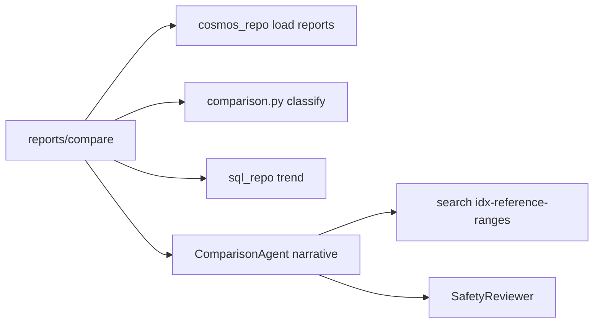
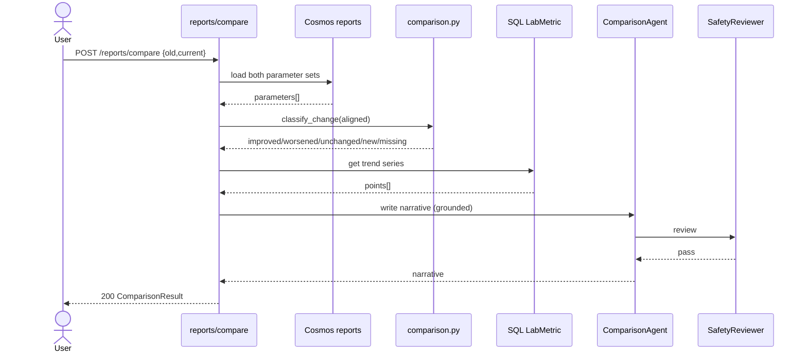

# Feature 3 - Report Comparison Engine

## 3.1 Feature Overview

- **Feature Name**: Medical Report Comparison Engine
- **Business Purpose**: Compare two lab reports (old vs current) and deterministically classify each shared parameter as improved, worsened, unchanged, newly abnormal, or missing, with trend visualization and a plain-language progression narrative.

### Functional Requirements

| ID | Requirement |
|----|-------------|
| FR3.1 | Accept two report IDs (from history) or two uploads. |
| FR3.2 | Align parameters by canonical key across reports. |
| FR3.3 | Classify change deterministically per the rules in §3.11. |
| FR3.4 | Produce trend series per repeated parameter for charts. |
| FR3.5 | LLM writes only the narrative; classification is Python. |
| FR3.6 | Include reference-range-grounded discussion points. |

### Non-Functional Requirements

| ID | Requirement | Target |
|----|-------------|--------|
| NFR3.1 | Comparison latency p95 | < 8 s (both reports already analyzed) |
| NFR3.2 | Classification determinism | 100% reproducible in unit tests |
| NFR3.3 | Grounded narrative | citations required |

### Assumptions

- A1: Both reports were previously analyzed (parameters normalized and stored). If a raw upload is provided, it is analyzed first via Feature 2 pipeline.
- A2: Thresholds: unchanged `<5%`, improved/worsened movement `>=10%` toward/away from range.
- A3: Trend series sourced from SQL `LabMetric` for longitudinal history beyond the two reports.

### Dependencies

- Cosmos `reports`, SQL `LabMetric`, Search `idx-reference-ranges`, `comparison.py`, `ComparisonAgent`.

## 3.2 Architecture Design

### Component Diagram Description

`api/reports.py` route `/reports/compare` loads both report parameter sets (via `cosmos_repo`), calls `comparison.classify_change()` (pure Python), builds trend series from `sql_repo.get_trend()`, then `ComparisonAgent` writes the narrative grounded in `idx-reference-ranges`, and Safety review finalizes.

### Service Interactions



### Sequence of Operations

1. Resolve both reports (analyze uploads first if needed).
2. Align by `canonicalKey`.
3. Classify each aligned parameter (Python).
4. Build trend series from `LabMetric`.
5. Narrative via LLM (grounded).
6. Safety review → response.

### Data Flow

`oldReportId + currentReportId` → parameter sets → aligned pairs → `ComparisonResult{improved,worsened,unchanged,newlyAbnormal,missing}` + `trendSeries[]` → narrative → envelope.

### Integration Points & External Systems

- Cosmos (parameter snapshots), SQL (trend), Search (explanations). No external OCR unless a raw upload is supplied.

## 3.3 API Design

### 3.3.1 POST /api/v1/reports/compare

| Attribute | Value |
|-----------|-------|
| URL | `/api/v1/reports/compare` |
| Method | `POST` (application/json) |
| Auth | Entra JWT; `HealthIQ.Reports.Read` |
| Idempotency | Pure function of the two report snapshots; safe to retry |
| Rate limits | 30 req/min/user |

Request:

```json
{ "oldReportId": "report-111", "currentReportId": "report-222" }
```

Response `data`:

```json
{
  "oldReportDate": "2026-03-10",
  "currentReportDate": "2026-06-14",
  "improved":   [ { "canonicalKey": "ldl", "old": 160, "current": 128, "unit": "mg/dL", "pctChange": -20.0, "status": "normal" } ],
  "worsened":   [ { "canonicalKey": "hba1c", "old": 6.4, "current": 7.4, "unit": "%", "pctChange": 15.6, "status": "high" } ],
  "unchanged":  [ { "canonicalKey": "creatinine", "old": 0.9, "current": 0.92, "unit": "mg/dL", "pctChange": 2.2 } ],
  "newlyAbnormal": [ { "canonicalKey": "tsh", "current": 6.1, "unit": "mIU/L", "status": "high" } ],
  "missing":    [ { "canonicalKey": "vitamin_d" } ],
  "trendSeries": [
    { "canonicalKey": "hba1c", "points": [ { "date": "2026-03-10", "value": 6.4 }, { "date": "2026-06-14", "value": 7.4 } ] }
  ],
  "narrative": "Cholesterol improved into the typical range, while HbA1c rose and may be worth discussing with a doctor."
}
```

Errors: `404 resource-not-found` (either report), `403 forbidden` (not owner), `422 no-comparable-parameters` (no shared keys).

#### API Interaction Flow

- **Caller**: Report Comparison tab.
- **Validation**: both IDs exist and belong to caller; at least one shared parameter.
- **Business logic**: deterministic classification + trend assembly.
- **Downstream**: Cosmos, SQL, Search.
- **Retry**: Search 2 retries; classification never retried (pure).
- **Failure**: if narrative LLM fails, return classification with `narrative=null` and `safety.notes=["narrative-unavailable"]`.

## 3.4 Data Design

- Reads Cosmos `reports.parameters[]` snapshots and SQL `LabMetric` (trend). No new tables.
- `IX_LabMetric_Trend(UserId, CanonicalKey, ReportDate)` is the critical read path.
- Retention inherits Feature 2.

## 3.5 Event-Driven Design

Request/response. Telemetry: `ReportsCompared`, `NewlyAbnormalDetected`. No broker in MVP.

## 3.6 Security Design

- Both report IDs authorized against `userId`.
- No raw PHI in comparison output beyond canonical values the user already owns.
- Audit to `runs`.

## 3.7 Observability

- Metrics: `comparison_pairs`, `newly_abnormal_rate`, `agent_latency_ms{agent=comparison}`.
- Alerts: classification exceptions, p95 > 8 s.
- Tracing: `comparison.classify`, `sql.trend`, `agent.comparison.turn`.

## 3.8 Scalability & Performance

- Classification is O(n) over parameters; trivially fast.
- Cache trend queries by `(userId, key)` short TTL.
- Bottleneck is narrative LLM, not math; can be skipped under load.

## 3.9 Error Handling

| Class | Handling |
|-------|----------|
| Divide-by-zero (`old==0`) | Guarded; treat as `newlyAbnormal`/`unchanged` per rule. |
| No shared keys | `422 no-comparable-parameters`. |
| Narrative failure | Return math-only result. |

## 3.10 Sequence Diagram



## 3.11 Detailed Processing Flow (deterministic classification)

```text
delta      = current - old
pctChange  = delta / old * 100      # guard old == 0
inRange(v) = refLow <= v <= refHigh

improved       : was out of range AND now in range, OR moved >=10% toward range
worsened       : was in range AND now out, OR moved >=10% away from range
unchanged      : |pctChange| < 5
newlyAbnormal  : absent in old AND out of range in current
missing        : present in old AND absent in current
```

Order of evaluation: `missing` → `newlyAbnormal` → `improved` → `worsened` → `unchanged` (first match wins). All arithmetic in `comparison.py`, fully unit-tested against the 3 sample report pairs.

## 3.12 Open Questions / Risks

- Unit mismatch across reports (must normalize before compare).
- Parameters present in both but measured on different methods/assays.
- Threshold tuning (5%/10%) validated only on demo pairs.

## 3.13 Recommendations

- **Best practices**: snapshot parameters at analyze time so comparison is stable even if ranges change later.
- **Performance**: skip narrative under load; math is the product value.
- **Future**: multi-report longitudinal trend (Phase 2), method-aware comparison.

---
