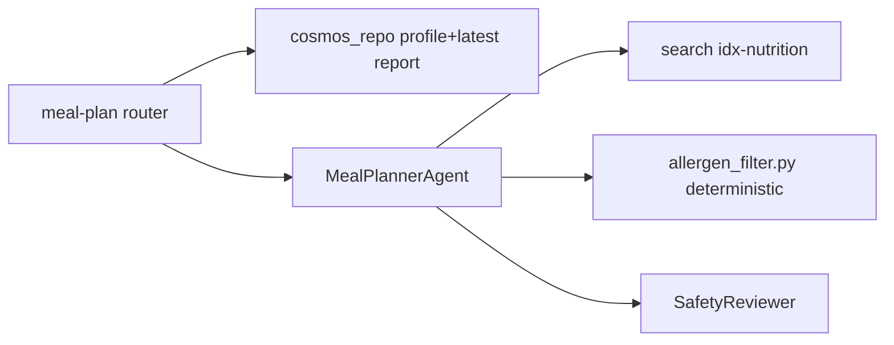
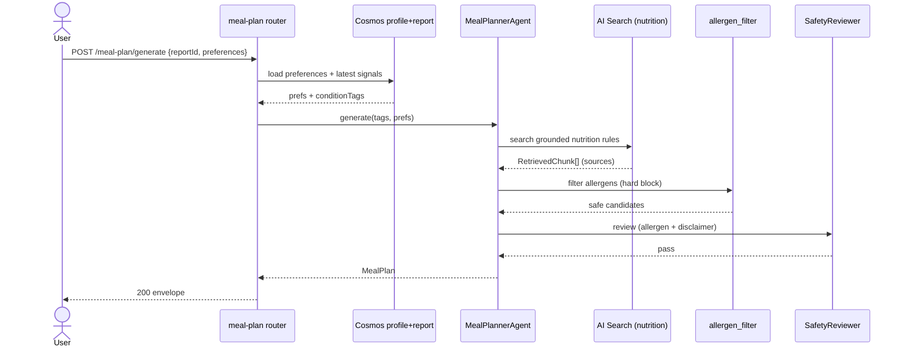

# Feature 4 - AI Meal Planner

## 4.1 Feature Overview

- **Feature Name**: AI Meal Planner
- **Business Purpose**: Generate safe, general, condition-aware meal suggestions grounded in nutrition knowledge, driven by the latest report findings, health goals, allergies, and cuisine/budget preferences. Hard-blocks allergens and avoids clinical prescriptions.

### Functional Requirements

| ID | Requirement |
|----|-------------|
| FR4.1 | Derive condition signals from latest report (e.g., high glucose → low-GI guidance). |
| FR4.2 | Accept allergy, cuisine, budget, and goal inputs. |
| FR4.3 | Produce a multi-day plan (default 3 days) with rationale and avoid list. |
| FR4.4 | Ground guidance in `idx-nutrition`; every claim carries a source. |
| FR4.5 | Hard-block allergens; never output supplement dosing or minor calorie prescriptions. |

### Non-Functional Requirements

| ID | Requirement | Target |
|----|-------------|--------|
| NFR4.1 | Meal plan latency p95 | < 12 s |
| NFR4.2 | Allergen safety | zero allergen leakage (verified by test) |
| NFR4.3 | Grounding | 100% claims cited |

### Assumptions

- A1: Nutrition rules curated in `data/nutrition/nutrition_rules.md` → `idx-nutrition`.
- A2: Condition signals map from abnormal parameters (glucose/HbA1c, LDL/cholesterol, etc.).
- A3: Plans are general guidance, not medical nutrition therapy.
- A4: Allergen list is authoritative from profile preferences.

### Dependencies

- Search `idx-nutrition`, Cosmos `profiles` (preferences), latest `reports` summary, `MealPlannerAgent`, `deidentify` (not needed - no raw PHI), safety pipeline.

## 4.2 Architecture Design

### Component Diagram Description

`api/mealplan.py` route `/meal-plan/generate` loads profile preferences + latest report condition signals, `MealPlannerAgent` calls tools `search_nutrition_rules` + `get_profile_preferences`, applies a deterministic allergen filter (Python) over candidate items, then LLM assembles the day plan; Safety review enforces allergen block + disclaimers.

### Service Interactions



### Sequence of Operations

1. Load preferences + latest report signals.
2. Derive condition tags (e.g., `diabetes-risk`, `high-cholesterol`).
3. RAG-fetch nutrition guidance per tag.
4. Deterministic allergen filter removes any item matching allergens.
5. LLM assembles 3-day plan + rationale.
6. Safety review (allergen block, no dosing) → response.

### Data Flow

`preferences + report signals` → condition tags → grounded guidance → allergen-filtered candidates → `MealPlan{days,rationale,avoidList,disclaimer}`.

### Integration Points & External Systems

- Search `idx-nutrition`; Cosmos `profiles`/`reports`. No OCR/PDF.

## 4.3 API Design

### 4.3.1 POST /api/v1/meal-plan/generate

| Attribute | Value |
|-----------|-------|
| URL | `/api/v1/meal-plan/generate` |
| Method | `POST` (application/json) |
| Auth | Entra JWT; `HealthIQ.MealPlan.Write` |
| Idempotency | `Idempotency-Key` optional; same inputs → same plan (temperature pinned low) |
| Rate limits | 20 req/min/user |

Request:

```json
{
  "reportId": "report-9ab...",
  "preferences": {
    "allergies": ["peanut"],
    "cuisine": "south-indian-veg",
    "budget": "low",
    "goals": ["reduce-hba1c"],
    "days": 3
  }
}
```

Response `data`:

```json
{
  "conditionTags": ["diabetes-risk"],
  "days": [
    {
      "day": 1,
      "meals": [
        { "type": "breakfast", "items": ["Vegetable oats upma"], "notes": "Low glycemic, high fiber",
          "source": { "name": "Nutrition rules", "url": "https://...", "date": "2026-05-01" } }
      ]
    }
  ],
  "avoidList": ["sugary beverages", "peanut (allergen)"],
  "rationale": [ { "text": "Low-GI meals support blood sugar management.", "source": { "url": "https://...", "date": "2026-05-01" } } ],
  "disclaimer": "General nutrition guidance only; not medical nutrition therapy. Discuss with a doctor or dietitian."
}
```

Errors: `404 resource-not-found` (report), `422 allergen-conflict` (requested cuisine wholly conflicts with allergens → returns safe subset + note), `400 validation-error`.

#### API Interaction Flow

- **Caller**: Meal Planner tab.
- **Validation**: report ownership; allergen list well-formed.
- **Business logic**: derive tags → RAG → allergen filter → assemble.
- **Downstream**: Search, Cosmos.
- **Retry**: Search 2 retries.
- **Failure**: if RAG returns no grounded guidance, return `422 no-grounded-guidance` (no ungrounded plan is ever emitted).

## 4.4 Data Design

- Reads `profiles.preferences` and latest `reports` summary; reads `idx-nutrition`.
- No new persistence; optionally cache generated plan on `runs` for audit.
- Retention inherits platform policy.

## 4.5 Event-Driven Design

Request/response. Telemetry: `MealPlanGenerated`, `AllergenBlocked`. Phase 2: regenerate on `ReportAnalyzed` event.

## 4.6 Security Design

- Allergen filter is a hard safety gate, enforced in Python before and validated by SafetyReviewer after.
- No supplement dosing; no minor calorie prescriptions (SafetyReviewer R3 extension).
- Profile/report authorized to `userId`.

## 4.7 Observability

- Metrics: `mealplan_latency_ms`, `allergen_block_count`, `nutrition_grounding_hits`.
- Alerts: allergen block anomalies (should be filtered pre-LLM), grounding miss spike.
- Tracing: `mealplan.tags`, `search.nutrition`, `allergen.filter`, `agent.mealplan.turn`.

## 4.8 Scalability & Performance

- Cache nutrition guidance per condition tag (stable content).
- Pin LLM temperature low for reproducibility + caching by input hash.
- Bottleneck: LLM assembly; mitigate with concise prompts + cached guidance.

## 4.9 Error Handling

| Class | Handling |
|-------|----------|
| Allergen conflict | Return safe subset + explicit avoid note. |
| No grounded guidance | `422 no-grounded-guidance`; never emit ungrounded plan. |
| LLM failure | Return structured guidance list without prose assembly. |

## 4.10 Sequence Diagram



## 4.11 Detailed Processing Flow

1. Validate report ownership; load `profiles.preferences`.
2. Derive condition tags from abnormal parameters of latest report.
3. For each tag, RAG-fetch nutrition guidance (grounded, with sources).
4. Deterministic allergen filter removes any candidate containing an allergen (substring + synonym match).
5. LLM assembles `days[]` from filtered candidates, respecting cuisine/budget.
6. Build `avoidList` (allergens + condition avoids) and cited `rationale`.
7. SafetyReviewer enforces allergen absence, disclaimer presence, no dosing/prescription language.
8. Return envelope; optionally audit to `runs`.

## 4.12 Open Questions / Risks

- Allergen synonym coverage (e.g., groundnut = peanut).
- Cuisine dataset breadth for demo variety.
- Interaction of multiple simultaneous conditions (conflicting guidance).

## 4.13 Recommendations

- **Best practices**: maintain an allergen synonym table; test allergen leakage explicitly.
- **Security**: double-gate allergens (pre-LLM filter + post-LLM safety check).
- **Future**: dietitian approval workflow (Phase 3), calorie targets with clinician sign-off, macro tracking.

---
