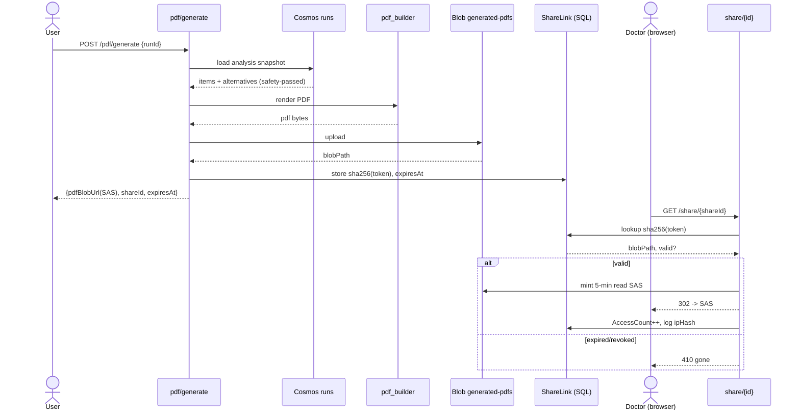

# Feature 5 - Doctor-Review PDF & Secure Share

## 5.1 Feature Overview

- **Feature Name**: Doctor-Review PDF Generation & Secure Share Link
- **Business Purpose**: Turn an analyzed prescription (or report summary) into a structured, doctor-reviewable PDF - framed explicitly as an approval request, not a prescription change - and expose it via a secure, time-bound, revocable share link.

### Functional Requirements

| ID | Requirement |
|----|-------------|
| FR5.1 | Generate a PDF from a `runId` with the mandated section order (§5.11). |
| FR5.2 | Include per-row OCR confidence and provenance (source + source date). |
| FR5.3 | Include doctor approval controls (Approve/Modify/Reject, notes, signature). |
| FR5.4 | Store PDF in `generated-pdfs` container. |
| FR5.5 | Issue a hashed `shareId` and a 24 h read-only user-delegation SAS. |
| FR5.6 | Serve `GET /share/{shareId}` with rate limiting and access logging; support revocation. |

### Non-Functional Requirements

| ID | Requirement | Target |
|----|-------------|--------|
| NFR5.1 | PDF generation p95 | < 5 s |
| NFR5.2 | Share link validity | 24 h, single blob, read-only |
| NFR5.3 | Share endpoint rate limit | 20 req/min/IP |
| NFR5.4 | Token security | 128-bit, stored SHA-256 hashed, revocable |

### Assumptions

- A1: PDF built with ReportLab (`pdf_builder.py`).
- A2: Only consented patient fields are included.
- A3: Share links contain no PHI; token is opaque.
- A4: `runId` already carries safety-passed analysis.

### Dependencies

- Blob (`generated-pdfs`), SQL `ShareLink`, `pdf_builder.py`, `share_links.py`, `blob.py`, Cosmos `runs`.

## 5.2 Architecture Design

### Component Diagram Description

`api/pdf.py` route `/pdf/generate` loads the `runId` analysis snapshot, `pdf_builder.build()` renders sections, `blob.upload()` stores it, `share_links.issue()` generates a token, stores its SHA-256 in `ShareLink`, and returns a user-delegation SAS. `api/share.py` route `/share/{shareId}` hashes the token, looks it up, checks expiry/revocation, rate-limits, logs access, and 302-redirects to a fresh SAS (or renders an HTML wrapper).

### Service Interactions

```mermaid
flowchart LR
    PG[pdf/generate] --> RUN[cosmos_repo run snapshot]
    PG --> PB[pdf_builder.py]
    PG --> BL[blob.py generated-pdfs]
    PG --> SL[share_links.py issue]
    SL --> SQ[SQL ShareLink hashed]
    SH[share/{id}] --> SQ
    SH --> BL2[blob user-delegation SAS]
```

### Sequence of Operations

1. Load run snapshot for `runId`.
2. Render PDF (sections in mandated order).
3. Upload to `generated-pdfs/{userId}/{runId}.pdf`.
4. Generate token; store `sha256(token)` + `blobPath` + `expiresAt` in `ShareLink`.
5. Return `pdfBlobUrl` (SAS) + `shareId` + `expiresAt`.
6. On `GET /share/{id}`: validate, rate-limit, log, 302 → fresh SAS.

### Data Flow

`runId` → analysis snapshot → PDF bytes → Blob → `ShareLink` row (hashed token) → SAS URL → client.

### Integration Points & External Systems

- Azure Storage user-delegation SAS (requires MI with `Storage Blob Delegator` + data role).

## 5.3 API Design

### 5.3.1 POST /api/v1/pdf/generate

| Attribute | Value |
|-----------|-------|
| URL | `/api/v1/pdf/generate` |
| Method | `POST` (application/json) |
| Auth | Entra JWT; `HealthIQ.Pdf.Write` |
| Idempotency | `Idempotency-Key` recommended; same `runId` reuses existing PDF + returns existing `shareId` unless `regenerate=true` |
| Rate limits | 15 req/min/user |

Request: `{ "runId": "run-2f1c...", "regenerate": false }`

Response `data`:

```json
{
  "pdfBlobUrl": "https://<acct>.blob.core.windows.net/generated-pdfs/oid-123/run-2f1c.pdf?<sas>",
  "shareId": "s_9dXk...opaque",
  "expiresAt": "2026-08-28T10:15:03Z"
}
```

Errors: `404 resource-not-found` (run), `403 forbidden` (not owner), `409 conflict` (PDF generation in progress), `502 upstream-unavailable` (storage).

### 5.3.2 GET /api/v1/share/{shareId}

| Attribute | Value |
|-----------|-------|
| URL | `/api/v1/share/{shareId}` |
| Method | `GET` |
| Auth | **Anonymous** (token is the bearer); no Entra required |
| Path param | `shareId` (opaque token) |
| Idempotency | Read-only |
| Rate limits | 20 req/min/IP (APIM policy) |

Behavior: `302` redirect to a freshly minted 5-minute read-only SAS for the single blob, or render an HTML landing page embedding it. Increments `AccessCount`; logs timestamp + `ipHash`.

Errors: `404 resource-not-found` (unknown/hashed miss), `410 gone` (expired or `RevokedAt` set), `429 rate-limited`.

#### API Interaction Flow

- **Caller**: Prescription tab (generate); external browser (share).
- **Validation**: run ownership (generate); token hash lookup + expiry/revocation (share).
- **Business logic**: render, store, tokenize; hash-compare on access.
- **Downstream**: Blob, SQL `ShareLink`.
- **Retry**: storage upload 3 retries; SAS mint 2 retries.
- **Failure**: expired/revoked → `410`; abuse → `429` + alert.

## 5.4 Data Design

### Tables

`ShareLink` (per plan §4.3): `ShareId` PK stores **SHA-256 of token**, `BlobPath`, `UserId`, `ExpiresAt`, `RevokedAt`, `AccessCount`.

### Entity Relationship Description

`run 1..1 PDF blob 1..1 ShareLink`. A revocation sets `RevokedAt`; access checks `RevokedAt IS NULL AND ExpiresAt > now`.

### Indexing Strategy

- PK on hashed `ShareId` gives O(1) lookup.
- Optional index on `ExpiresAt` for cleanup jobs.

### Data Retention

- PDFs and share links expire at 24 h; lifecycle rule deletes generated blobs after 7 days; expired `ShareLink` rows purged by cleanup.

### Migration Requirements

- Create `ShareLink` table via `seed_sql.py` schema step.

## 5.5 Event-Driven Design

Telemetry events: `PdfGenerated`, `ShareIssued`, `ShareAccessed`, `ShareRevoked`, `ShareExpiredHit`. Phase 2: async PDF pre-generation via Event Grid with DLQ.

## 5.6 Security Design

- **Token**: 128-bit URL-safe random; only its SHA-256 persisted (no reversible token at rest).
- **SAS**: user-delegation, read-only, single blob, short TTL, minted per access.
- **RBAC**: MI `Storage Blob Data Reader` + `Storage Blob Delegator`.
- **No PHI in URL**; opaque, revocable token.
- **Rate limiting + access logging** (timestamp, `ipHash`) on every share hit.
- **Human-in-the-loop**: PDF is an approval request; doctor approval section mandatory.

## 5.7 Observability

- Metrics: `pdf_success_rate`, `pdf_build_ms`, `share_access_count`, `share_expired_hits`, `share_revoked_count`.
- Alerts: PDF failure spike, share abuse (429 rate), unusual access geography (ipHash cardinality).
- Tracing: `pdf.build`, `blob.upload`, `share.issue`, `share.resolve`.

## 5.8 Scalability & Performance

- PDF rendering is CPU-bound; offload to worker if load grows; cache by `runId`.
- Reuse existing PDF unless `regenerate=true`.
- Bottleneck: SAS minting under burst; cache delegation key (respect its own expiry).

## 5.9 Error Handling

| Class | Handling |
|-------|----------|
| Missing run | `404`. |
| Storage failure | Retry 3x → `502`. |
| Expired/revoked share | `410 gone`. |
| Rate abuse | `429` + security alert. |

## 5.10 Sequence Diagram



## 5.11 Detailed Processing Flow (PDF section order)

1. Header: "Doctor Review Request - Not a Prescription", timestamp, Health IQ branding.
2. Patient block: only consented fields.
3. Prescribed medicines table (as extracted, with per-row OCR confidence).
4. Suggested equivalents table: original, composition, generic, cheaper, estimated savings, source + source date.
5. Doctor approval section: per-row Approve/Modify/Reject, notes, signature + date.
6. Footer: disclaimer + provenance list + "Data is demo/curated" notice.

Then: upload → tokenize (hash-at-rest) → issue SAS → return. Share access hashes token, checks validity, rate-limits, logs, redirects.

## 5.12 Open Questions / Risks

- SAS delegation key caching vs. rotation.
- HTML landing vs. direct redirect (embed viewer?).
- Handling very large equivalents tables (pagination in PDF).

## 5.13 Recommendations

- **Best practices**: reuse PDFs; keep token hashing + short SAS TTL.
- **Security**: alert on repeated `410`/`429` (enumeration attempts); consider per-share access cap.
- **Performance**: pre-generate in `DEMO_MODE`.
- **Future**: secure patient-doctor portal, e-signature capture, audit trail export (Phase 3).

---
