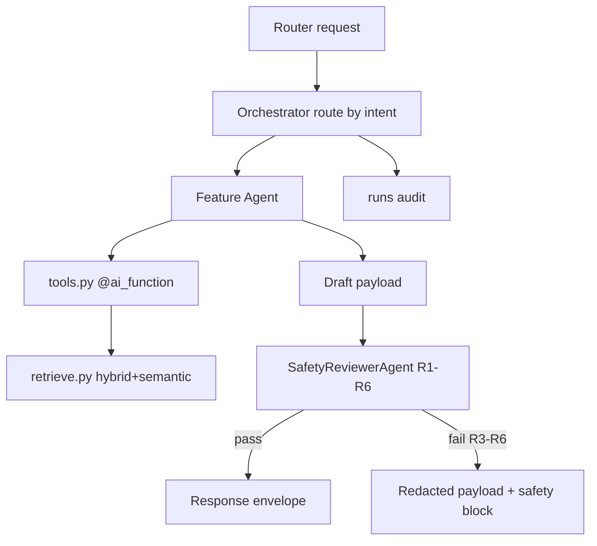
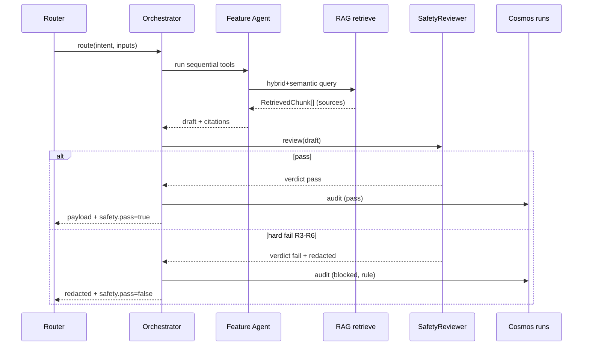

# Feature 6 - Safety Reviewer & Agent Orchestrator (Cross-Cutting)

This is the platform's responsible-AI backbone. The **Orchestrator** routes every request to a feature agent and enforces the **SafetyReviewerAgent** as a mandatory final stage on all user-facing payloads. It also owns the RAG grounding contract shared by all features.

## 6.1 Feature Overview

- **Feature Name**: Agent Orchestrator + Safety Reviewer + RAG Grounding
- **Business Purpose**: Guarantee that no output ships without a disclaimer, provenance, and confidence; block diagnosis/prescription-change language; enforce citation-required grounding; and route intents to the correct agent deterministically.

### Functional Requirements

| ID | Requirement |
|----|-------------|
| FR6.1 | Build one `ChatAgent` per role over `AzureOpenAIChatClient` with `DefaultAzureCredential`. |
| FR6.2 | Route by intent to the correct feature agent; run sequential workflow per feature. |
| FR6.3 | Run `SafetyReviewerAgent` as the final stage on every payload. |
| FR6.4 | Enforce safety rules R1-R6; hard-fail on R3-R6. |
| FR6.5 | Enforce RAG contract: no claim without an attached `RetrievedChunk`. |
| FR6.6 | Treat OCR/user text as untrusted data (prompt-injection defense). |

### Non-Functional Requirements

| ID | Requirement | Target |
|----|-------------|--------|
| NFR6.1 | Safety review overhead p95 | < 1.5 s |
| NFR6.2 | Red-team block rate | 100% (diagnosis/dosage/emergency prompts) |
| NFR6.3 | Determinism of rule checks R1-R6 | reproducible |
| NFR6.4 | Zero uncited medical claims | enforced by R2 |

### Assumptions

- A1: Standard disclaimer string is a versioned constant.
- A2: Banned-phrase list is maintained and unit-tested.
- A3: Each agent has a versioned system prompt in `agents/prompts/*.md`.
- A4: Safety verdict is attached to every response envelope.

### Dependencies

- Azure OpenAI (`gpt-4o`), Agent Framework, `rag/retrieve.py`, all feature agents, Cosmos `runs` (audit).

## 6.2 Architecture Design

### Component Diagram Description

`agents/orchestrator.py` instantiates agents and registers `@ai_function` tools from `agents/tools.py`. A request enters via a router → orchestrator selects the feature agent by intent → agent executes tools producing a draft → `SafetyReviewerAgent` validates → orchestrator returns the (possibly redacted) payload. RAG `retrieve.py` returns `RetrievedChunk{content,score,sourceName,sourceUrl,sourceDate}`; agents are prompt-bound to cite.

### Service Interactions



### Sequence of Operations

1. Router calls orchestrator with feature intent + inputs.
2. Orchestrator invokes the feature agent (sequential tool workflow).
3. Agent produces draft with attached `RetrievedChunk[]`.
4. SafetyReviewer runs R1-R6.
5. On pass → return; on R3-R6 fail → return redacted payload + `safety` block.
6. Audit verdict to `runs`.

### Data Flow

`inputs` → agent tool calls → grounded draft → safety verdict → envelope (`safety.pass`, `safety.notes`).

### Integration Points & External Systems

- Azure OpenAI (chat + safety), Azure AI Search (grounding), Cosmos (audit).

## 6.3 RAG Grounding Contract (shared)

Every retrieval returns:

```json
{ "content": "HbA1c reflects ~3-month average blood glucose.",
  "score": 0.83, "sourceName": "Curated ref ranges",
  "sourceUrl": "https://...", "sourceDate": "2026-05-01" }
```

Common index config: `text-embedding-3-large` (3072 dims), HNSW, semantic configuration, hybrid query (`search` + `vectorQueries`), `queryType=semantic`, `top=5`. Ingestion is idempotent (`sha1(source+row_key)` doc IDs), batches of 100, verified counts.

| Index | Purpose |
|-------|---------|
| `idx-medicines` | Composition + alternative lookup |
| `idx-reference-ranges` | Patient-friendly parameter meaning |
| `idx-specialists` | Abnormality → specialist category |
| `idx-nutrition` | Meal planning grounding |

## 6.4 API Design

The orchestrator and safety reviewer are **internal** (no public endpoint). Their contract is the `safety` block present in every feature response envelope (see §0.3) plus an internal admin probe:

### 6.4.1 GET /api/v1/health (liveness)

| Attribute | Value |
|-----------|-------|
| URL | `/api/v1/health` | 
| Method | `GET` | 
| Auth | Anonymous | 
| Response | `{ "status": "ok", "version": "1.0.0", "checks": { "openai": "ok", "search": "ok", "cosmos": "ok", "sql": "ok" } }` |

Used by the App Insights availability test.

## 6.5 Safety Reviewer Rules

| Rule | Check | Severity |
|------|-------|----------|
| R1 | Payload contains the standard disclaimer string | hard |
| R2 | Every medical/nutritional claim carries `sourceUrl` + `sourceDate` | hard |
| R3 | No banned phrases: "you have", "diagnosed with", "stop taking", "replace your", "cure", "guaranteed" | hard |
| R4 | Alternatives carry `doctorApprovalRequired=true` + `savingsEstimated=true` | hard |
| R5 | Confidence below threshold forces `needsUserConfirmation=true` | hard |
| R6 | No PHI leaked into shareable artifacts beyond consent | hard |

Violations of R3-R6 cause hard failure; the API returns the redacted payload plus a `safety` block explaining suppression. Verdict schema:

```json
{ "pass": false, "violations": [ { "rule": "R3", "detail": "banned phrase 'stop taking' at items[0].note" } ], "redactedPayload": { } }
```

## 6.6 Data Design

- No dedicated tables; writes safety verdict + tool trace to Cosmos `runs`.
- Banned-phrase list and disclaimer string are versioned config (`config.py`).

## 6.7 Event-Driven Design

Telemetry: `SafetyPassed`, `SafetyBlocked{rule}`, `GroundingMiss`, `IntentRouted{agent}`. `safety_block_count` is a first-class metric and alert source.

## 6.8 Security Design

- **Prompt-injection defense**: OCR/user text wrapped in explicit delimiters, passed as data; system prompts forbid instruction-following from content.
- **Least privilege**: agents call only registered tools; no arbitrary code/network.
- **Auditability**: every turn's tool calls, agent versions, and verdict recorded in `runs`.
- **Disclaimer + provenance** enforced structurally, not by model goodwill.

## 6.9 Observability

- Metrics: `safety_block_count{rule}`, `grounding_miss_rate`, `agent_latency_ms{agent}`, `intent_route_count{agent}`.
- Dashboards: safety funnel (drafts vs blocks by rule), grounding coverage.
- Alerts: safety block anomaly, grounding miss spike, agent latency p95 breach.
- Tracing: `orchestrator.route`, `agent.<role>.turn`, `safety.review`, `rag.retrieve`.

## 6.10 Scalability & Performance

- SafetyReviewer uses deterministic checks first (cheap), LLM classification only for nuanced language.
- Cache grounding results by query hash.
- Bottleneck: extra LLM turn for safety; keep prompt minimal, run structural checks in Python.

## 6.11 Error Handling

| Class | Handling |
|-------|----------|
| Grounding miss (no chunk) | Block claim; agent must re-query or drop uncited content. |
| Safety hard fail | Return redacted payload + `safety.pass=false`. |
| Safety reviewer LLM failure | Fail closed: suppress payload, return safe fallback message. |

## 6.12 Sequence Diagram



## 6.13 Detailed Processing Flow

1. Router passes intent + validated inputs to orchestrator.
2. Orchestrator selects agent, runs its sequential tool workflow.
3. Agent attaches `RetrievedChunk[]` to every claim (RAG contract).
4. Draft handed to SafetyReviewer.
5. Structural checks (R1, R2, R4, R5) run in Python; nuanced language (R3) via classifier + banned-phrase regex; R6 checks PHI in shareable fields.
6. On any R3-R6 violation → redact + fail; else pass.
7. Verdict + tool trace written to `runs`; envelope returned.

## 6.14 Open Questions / Risks

- Banned-phrase list completeness vs. false positives on legitimate text.
- Fail-closed behavior UX (what the user sees on suppression).
- Grounding recall gaps for sparse curated data.

## 6.15 Recommendations

- **Best practices**: version prompts + rule set; snapshot red-team suite in CI.
- **Security**: keep structural safety checks deterministic and testable; treat LLM safety as defense-in-depth, not sole gate.
- **Performance**: run cheap deterministic checks before the LLM safety turn.
- **Future**: Azure AI Content Safety integration, evaluation pipeline (Phase 4), policy-as-code for rules.

---
