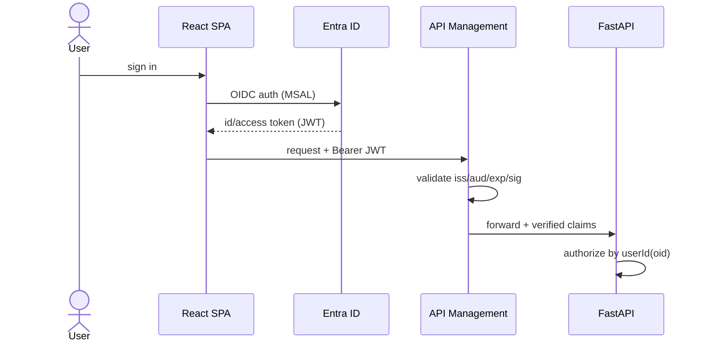
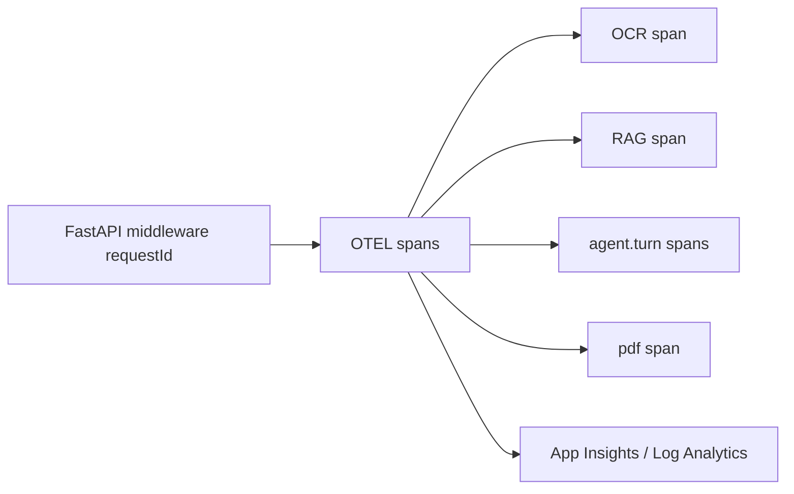
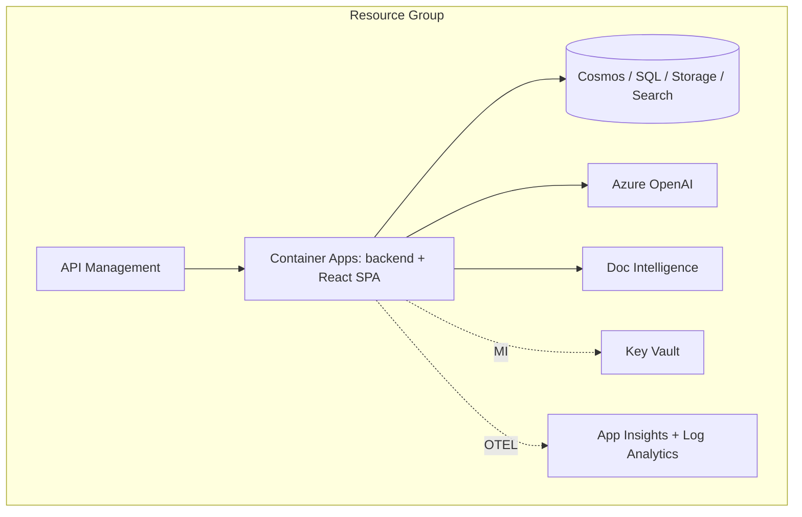
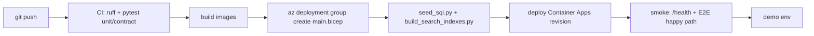

# Section 7 - Cross-Cutting Platform Design

This section consolidates platform-wide concerns that span all features: security & RBAC, observability, scalability, deployment/CI-CD, and the consolidated risk register.

## 7.1 Security & RBAC (platform)

### Authentication Flow

### Authorization Model / RBAC

- **User-scope**: all data partitioned by `userId` (Entra `oid`); repositories enforce owner-only access; cross-user → `403`.
- **API scopes**: `HealthIQ.Prescriptions.*`, `HealthIQ.Reports.*`, `HealthIQ.Profile.*`, `HealthIQ.MealPlan.*`, `HealthIQ.Pdf.*`, `HealthIQ.Medicines.Read`.
- **Azure RBAC (managed identity)**:

| Resource | Role | Scope |
|----------|------|-------|
| Storage (raw/generated) | Storage Blob Data Contributor + Storage Blob Delegator | container |
| Cosmos DB | Cosmos DB Built-in Data Contributor | database |
| Azure SQL | Entra-auth `db_datareader` + scoped writer | database |
| AI Search | Search Index Data Reader (+ Contributor for build job) | service |
| OpenAI | Cognitive Services OpenAI User | resource |
| Doc Intelligence | Cognitive Services User | resource |
| Key Vault | Key Vault Secrets User | vault |

### Data Encryption

- At rest: Storage/Cosmos/SQL platform encryption (Microsoft-managed keys; CMK-ready for Phase 4).
- In transit: TLS 1.2+ everywhere; private endpoints/firewall on data services.

### Secrets Management

- Key Vault references only; `DefaultAzureCredential`; `.env` is dev-only and gitignored; no keys/connection strings in code or config.

### Audit Logging

- Cosmos `runs` logs input hash, tool calls, agent versions, safety verdict per request.
- Share access logs timestamp + `ipHash`.

### RAI / Safety Controls (consolidated)

| Control | Mechanism | Feature |
|---------|-----------|---------|
| Consent-first | Blocking modal; consent version persisted per upload | 1,2 |
| PHI minimization | `deidentify.py` before LLM; age band not DOB | 1,2 |
| Human-in-the-loop | Doctor approval section on PDF | 5 |
| Grounding | Citation check (R2) | all |
| Safe language | Banned-phrase check (R3) | all |
| Allergen safety | Pre-LLM filter + R3 extension | 4 |
| Share safety | Hashed token, 24h SAS, revocable, rate-limited | 5 |

## 7.2 Observability (platform)

### Logging Requirements

- Structured JSON logs with `requestId`, `userIdHash`, `runId`, `feature`, `latencyMs`; never log PHI content.

### Metrics (custom)

`ocr_confidence`, `agent_latency_ms{agent}`, `safety_block_count{rule}`, `alternative_match_rate`, `pdf_success_rate`, `grounding_miss_rate`, `report_parse_rate`, `share_access_count`.

### Dashboards

- Feature funnels (upload→OCR→confirm→result), OCR confidence histogram, safety block breakdown, latency p95 per endpoint, upstream dependency health.

### Alerts

- 5xx rate spike, OCR failure spike, p95 budget breach (12s/15s), safety block anomaly, share abuse (429), availability test failure.

### Distributed Tracing

- OpenTelemetry spans across OCR, retrieval, each agent turn, PDF; exported to App Insights; trace correlation via `requestId`.

## 7.3 Scalability & Performance (platform)

- **Expected load**: MVP/demo < 5 concurrent; design headroom ~50 rps.
- **Caching**: catalog match LRU, reference ranges/explanations, nutrition guidance, grounding by query hash, `DEMO_MODE` cached OCR/retrieval.
- **Scaling**: Container Apps horizontal autoscale on concurrency; async I/O throughout; connection pooling to SQL/Cosmos.
- **Bottlenecks**: Document Intelligence latency, OpenAI TPM, layout OCR on large reports.
- **Optimizations**: precomputed embeddings, concise prompts, deterministic Python for all math, bounded-concurrency RAG fan-out.
- **Performance budgets**: prescription p95 < 12 s, report analysis p95 < 15 s, comparison p95 < 8 s, PDF p95 < 5 s.

## 7.4 Deployment Design

### Environment Architecture

- Environments: `local` (stub user, `.env`), `dev`/`demo` (Azure). Resource group per environment.
- Hosting: Azure Container Apps (backend + React SPA via static hosting / Container Apps) with managed identity; APIM in front.
- IaC: Bicep `infra/main.bicep` + modules (storage, cosmos, sql, search, docintel, openai, keyvault, monitoring).

### CI/CD Flow

### Infrastructure Dependencies

- Bicep must provision all resources with MI + RBAC before app deploy.
- Seed scripts must run after SQL + Search exist and before smoke tests.

### Configuration Management

- `pydantic-settings` in `config.py`, bound to Key Vault; typed settings object; per-env parameter files (`main.parameters.json`).
- Feature flags: `DEMO_MODE`, confidence thresholds, rate limits.

### Rollback Strategy

- Container Apps revision-based rollback (shift traffic to previous healthy revision).
- IaC is declarative; re-apply previous Bicep to revert infra.
- Data migrations are additive; seed scripts idempotent (safe re-run).

## 7.5 Consolidated Risk Register

| Risk | Impact | Mitigation | Owner feature |
|------|--------|------------|---------------|
| Handwriting OCR failure | Wrong extraction | 0.75 confidence gate, mandatory confirmation, manual entry fallback | 1 |
| Wrong alternative match | Patient safety | Hard equality on ingredient/strength/form, 24-mo freshness, exact multiset for combos, doctor approval flag | 1 |
| Stale price data | Wrong savings | `sourceDate` shown, savings labeled estimated | 1 |
| Hallucinated explanation | Unsafe guidance | RAG citation-required (R2), SafetyReviewer (R3) | 2,3,4,6 |
| Allergen leakage | Health harm | Pre-LLM allergen filter + post R3 check | 4 |
| Share-link abuse | Data exposure | Hashed token, 24h SAS, rate limit, revocation, access logging | 5 |
| PHI exposure | Privacy | De-identify pre-LLM, RBAC, private endpoints, audit logs | all |
| Live-demo flakiness | Demo failure | `DEMO_MODE` cached OCR/retrieval, backup recording | all |
| Azure quota/latency | Latency SLA miss | Pre-provision day 0, warm deployments, p95 tracking | all |
| Scope creep | Delivery risk | Out-of-scope list enforced; new items → Phase 2 backlog | all |

## 7.6 Platform Open Questions

- Region/subscription selection and OpenAI quota confirmation.
- Private endpoint vs. firewall for data services in demo timeline.
- APIM presence in MVP vs. direct Container Apps ingress with built-in JWT validation.
- HEIC server-side decoding library choice.

## 7.7 Platform Recommendations

- Adopt contract-first OpenAPI and generate typed TypeScript client stubs for the React SPA.
- Keep all numeric/business logic deterministic and unit-tested; reserve the LLM for language.
- Run the red-team safety suite in CI as a release gate.
- Track p95 budgets as SLOs in App Insights from day 0.
- Phase 2+: Event Grid async flows with DLQ, openFDA/NPPA live pricing, FHIR ingestion, Azure AI Content Safety, evaluation pipeline.
