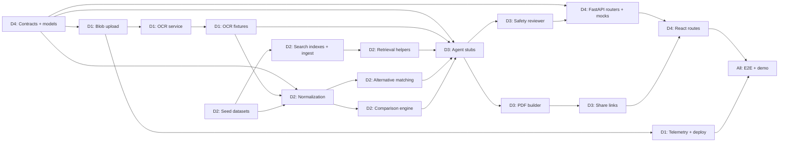

## 1. Team Roles

| Dev | Role | Owns | Primary skills needed |
|-----|------|------|-----------------------|
| **D1** | Platform and Ingestion | Bicep/IaC, Key Vault, Blob, Document Intelligence, de-identification, observability, deployment | Azure, Python, DevOps |
| **D2** | Domain Data and RAG | Seed datasets, medicine/lab normalization, comparison math, Azure AI Search indexes, ingestion pipeline | Python, data modelling, search |
| **D3** | Agents and Outputs | Microsoft Agent Framework, 6 agents, tools, safety reviewer, PDF builder, share links | Python, LLM/prompting |
| **D4** | API and Frontend | FastAPI routers, pydantic contracts, React + TypeScript 4-route UI, charts, consent/disclaimer components, demo assets | Python, FastAPI, React/TypeScript |

**Rule:** D4 owns the contracts. All pydantic models in `backend/app/models/` are written by D4 on Day 1 and frozen by end of Day 1. Everyone codes against them.

---

## 2. Unblock Strategy - Contract First, Mock Everything

The single biggest risk with four parallel developers is serialization. Kill it on Day 1:

1. **D4 publishes `app/models/` + OpenAPI stub before lunch on Day 1.** Every endpoint returns a hardcoded fixture matching the real schema.
2. **D1 commits `tests/fixtures/ocr/*.json`** (raw OCR envelopes for 2 prescriptions + 2 reports) by end of Day 1. D2 and D3 build against these files, not the live OCR service.
3. **D2 commits `data/*.csv` seed rows for 10 medicines and 8 lab parameters by end of Day 1**, even if incomplete. D3 builds retrieval tools against a local in-memory stub that mirrors the `RetrievedChunk` shape.
4. **D3 commits agent stubs that return canned `Safety`-wrapped payloads by Day 2 morning**, so D4's UI can render real shapes immediately.

Nobody waits on anybody after Day 1 noon.

---

## 3. Dependency Graph

### Critical path

`Contracts -> OCR service -> Normalization -> Alternative matching / Comparison -> Agents -> Safety -> API -> UI -> E2E`

Longest chain runs through **D1 (OCR) -> D2 (normalization) -> D3 (agents)**. Protect it: D1 must ship OCR fixtures on Day 1, and D2 must ship normalization by Day 2 noon. Everything else has slack.

---

## 4. Day-by-Day Plan (Aug 27 - Aug 31)

### Day 1 - Thu Aug 27: Foundation and contracts

| Dev | Tasks | Done when |
|-----|-------|-----------|
| **D1** | Init repo + `uv` + ruff + pytest; provision resource group; write and deploy `infra/main.bicep` (Storage, Cosmos, SQL, Search, Doc Intelligence, OpenAI, Key Vault, App Insights); assign managed-identity RBAC; commit `.env.example` | `az deployment group create` green; all endpoints reachable |
| **D1 (2nd half)** | Manually run Doc Intelligence on 2 prescriptions + 2 reports; commit raw JSON to `tests/fixtures/ocr/` | Fixtures committed and announced in channel |
| **D2** | Author seed datasets: `medicine_catalog.csv` (start 20 rows), `lab_reference_ranges.csv` (17 canonical params), `specialist_mapping.csv`, `lab_synonyms.json` | Files committed; schema matches section 4 of implementation plan |
| **D3** | Set up `AzureOpenAIChatClient` with `DefaultAzureCredential`; verify a `gpt-4o` round trip; scaffold `agents/orchestrator.py` and 6 empty agent modules; draft prompt files | "hello world" agent call returns a response |
| **D4** | **Write and freeze `app/models/` pydantic schemas for all 11 endpoints**; FastAPI app factory, `/health`, error handlers, request-id middleware; all routers returning fixtures; React shell with 4 routes + consent modal + disclaimer footer | OpenAPI docs render; UI shell talks to mocked API |

**End-of-day sync (30 min):** review frozen contracts, confirm fixture availability, confirm Azure access for all four.

---

### Day 2 - Fri Aug 28: Ingestion, normalization, RAG

| Dev | Tasks | Depends on |
|-----|-------|------------|
| **D1** | `services/blob.py` (upload, path convention, size/MIME/magic-byte validation, consent metadata); `services/ocr.py` (prebuilt-read + prebuilt-layout, async polling, retry, timeout, confidence envelope); `services/deidentify.py` | Day 1 infra |
| **D2** | `normalize_medicine.py` (cleaning, RapidFuzz match, strength regex, confirmation flags); `normalize_lab.py` (synonyms, unit conversion, report-date extraction, status computation); expand catalog to 60+ rows | D1 fixtures, Day 1 datasets |
| **D3** | Implement `agents/tools.py` `@ai_function` wrappers against D2/D1 stubs; build `SafetyReviewerAgent` with rules R1-R6 (pure Python checks + LLM pass); wire sequential orchestration | D4 contracts |
| **D4** | Real router implementations for `/prescriptions/analyze`, `/reports/analyze`, `/profile`; Cosmos + SQL repositories; Prescription Analyzer tab with OCR preview and editable confirmation grid | D1 blob/OCR interfaces |

**Noon checkpoint:** D2 normalization must be importable and passing unit tests. If slipping, D3 pairs on it - it is the critical path.

**End of Day 2 goal:** upload a real prescription and get normalized medicine entities through the live API.

---

### Day 3 - Sat Aug 29: RAG, matching, agents

| Dev | Tasks | Depends on |
|-----|-------|------------|
| **D1** | Seed SQL (`scripts/seed_sql.py`); Cosmos containers + indexing policy; OpenTelemetry spans for OCR and HTTP; App Insights dashboard | Day 2 |
| **D2** | `rag/indexes.py` + `rag/ingest.py` + `rag/retrieve.py` for all 4 indexes (hybrid + semantic, `RetrievedChunk` with provenance); `alternative matching` rules; `services/comparison.py` classification math + unit tests | Datasets, normalization |
| **D3** | Implement all 5 feature agents with real tools and citation-required prompts; run safety reviewer as mandatory final stage; red-team prompt list | D2 retrieval, D2 matching |
| **D4** | `/medicines/alternatives`, `/reports/compare`, `/specialists/suggest`, `/meal-plan/generate` routers; Health Profile tab (score gauge, system cards, history timeline); Report Comparison tab (color table, line chart, radar chart) | D2/D3 outputs |

**End of Day 3 goal:** all four features produce grounded, safety-reviewed output end to end, even if visuals are rough.

---

### Day 4 - Sun Aug 30: PDF, share, UI polish, integration

| Dev | Tasks | Depends on |
|-----|-------|------------|
| **D1** | Deploy backend + React SPA to Container Apps; availability test + alerts; security pass (private access, no secrets, dependency scan); blob lifecycle rule | Day 3 |
| **D2** | Expand fixtures to 5 prescriptions + 3 report pairs; tune fuzzy thresholds and synonym coverage against them; unit tests for savings math and unit conversion | Day 3 |
| **D3** | `services/pdf_builder.py` (6 sections, approval checkboxes, provenance footer); share links (hashed token, 24 h user-delegation SAS, rate limit, revoke); `/pdf/generate` + `/share/{id}` | D2 alternatives |
| **D4** | Meal Planner tab; wire PDF download + share link into UI; loading/error states; low-confidence confirmation UX; responsive layout pass | D3 PDF |

**End-of-day integration freeze (2 h, all four):** run the full demo path together, log defects, assign fixes.

---

### Day 5 - Mon Aug 31: Hardening and demo

| Dev | Tasks |
|-----|-------|
| **D1** | `DEMO_MODE=true` fixture replay path; final deploy; verify telemetry and metrics (`ocr_confidence`, `agent_latency_ms`, `safety_block_count`, `pdf_success_rate`); rollback plan |
| **D2** | Data QA on demo set; fix any mismatched parameter or missing alternative; finalize provenance dates |
| **D3** | Run red-team suite (diagnosis, dosage change, emergency advice) - all must block; fix safety gaps; verify every output carries disclaimer + citations |
| **D4** | Contract + integration tests green; UI copy review; `docs/demo-script.md`, one-pager, slides; record backup demo video |

**Final 2 hours:** two full dry runs, one on live services and one in `DEMO_MODE`.

---

## 5. Priority Tiers

Work strictly top-down. If time runs out, cut from the bottom.

| Tier | Items | Rationale |
|------|-------|-----------|
| **P0 - Demo blockers** | Contracts, IaC, blob upload, OCR service, medicine normalization, alternative matching, prescription agent, safety reviewer, PDF, Prescription tab | This is the headline demo |
| **P1 - Core value** | Lab normalization, reference ranges, report analysis agent, comparison engine, Health Profile tab, Report Comparison tab, search indexes | Second and third demo beats |
| **P2 - Differentiators** | Specialist advisor, meal planner, radar/trend charts, share links | High judge appeal, lower risk if trimmed |
| **P3 - Nice to have** | De-identification depth, Entra ID real login, Container Apps deploy, multilingual copy, doctor-directory links | Stub or fake if schedule slips |

### Cut list if behind schedule

1. Drop Entra ID; use a hardcoded demo user.
2. Drop Container Apps; demo from localhost with tunnels.
3. Reduce meal plan from 3 days to 1 day.
4. Replace radar chart with a second bar chart.
5. Run in `DEMO_MODE` for the whole presentation.

---

## 6. Interface Contracts Between Developers

These are the exact handoff points. Each is a file that one dev writes and others import.

| Contract | Written by | Consumed by | Frozen by |
|----------|-----------|-------------|-----------|
| `app/models/*.py` (all pydantic schemas) | D4 | D1, D2, D3 | Day 1 EOD |
| `services/ocr.py: extract(file) -> OcrEnvelope` | D1 | D2, D3 | Day 2 noon |
| `tests/fixtures/ocr/*.json` | D1 | D2, D3, D4 | Day 1 EOD |
| `normalize_medicine.py: normalize(ocr) -> list[MedicineEntity]` | D2 | D3, D4 | Day 2 EOD |
| `normalize_lab.py: normalize(ocr) -> list[LabParameter]` | D2 | D3, D4 | Day 2 EOD |
| `rag/retrieve.py: search(index, query) -> list[RetrievedChunk]` | D2 | D3 | Day 3 noon |
| `agents/orchestrator.py: run(feature, payload) -> AgentResult` | D3 | D4 | Day 3 EOD |
| `services/pdf_builder.py: build(analysis) -> bytes` | D3 | D4 | Day 4 EOD |

Any change to a frozen contract requires a message in the team channel plus a fix-forward PR by the owner.

---

## 7. Sync Cadence

| When | Duration | Purpose |
|------|----------|---------|
| Daily 09:30 | 10 min | Standup - blockers only |
| Daily 13:00 | 5 min | Critical-path checkpoint (D1 -> D2 -> D3) |
| Daily 18:00 | 20 min | Demo the day's increment, merge to `main` |
| Day 4 evening | 2 h | Full integration freeze, all four together |

### Branch and merge rules

* Branch per dev: `dev/d1-platform`, `dev/d2-data`, `dev/d3-agents`, `dev/d4-api-ui`.
* Merge to `main` at least once per day; `main` must always run.
* No force pushes. PRs need one reviewer, but do not block on review longer than 30 minutes during a hackathon.

---

## 8. Individual Task Checklists

### D1 - Platform and Ingestion

1. Repo init, `uv`, ruff, pytest, `.env.example` (Day 1 AM)
2. `infra/main.bicep` + modules, deploy, RBAC, Key Vault (Day 1 AM/PM) **[P0]**
3. OCR fixtures for 4 documents (Day 1 PM) **[P0, unblocks D2/D3]**
4. `services/blob.py` with validation and consent metadata (Day 2) **[P0]**
5. `services/ocr.py` read + layout, retry, confidence envelope (Day 2) **[P0]**
6. `services/deidentify.py` (Day 2 PM) **[P1]**
7. `scripts/seed_sql.py`, Cosmos setup (Day 3) **[P1]**
8. OpenTelemetry, custom metrics, alerts (Day 3-4) **[P2]**
9. Container Apps deploy, security pass, lifecycle rules (Day 4) **[P2]**
10. `DEMO_MODE` replay, final deploy, rollback plan (Day 5) **[P0]**

### D2 - Domain Data and RAG

1. Four seed datasets, initial rows (Day 1) **[P0, unblocks D3]**
2. `normalize_medicine.py` (Day 2 AM) **[P0, critical path]**
3. `normalize_lab.py` (Day 2 PM) **[P1]**
4. Catalog expansion to 60+ rows with provenance (Day 2 PM) **[P0]**
5. `rag/indexes.py`, `rag/ingest.py`, `scripts/build_search_indexes.py` (Day 3 AM) **[P1]**
6. `rag/retrieve.py` hybrid + semantic with provenance (Day 3 AM) **[P1]**
7. Alternative matching with hard equality rules (Day 3 PM) **[P0]**
8. `services/comparison.py` classification + unit tests (Day 3 PM) **[P1]**
9. Fixture expansion and threshold tuning (Day 4) **[P0]**
10. Data QA and provenance finalization (Day 5) **[P0]**

### D3 - Agents and Outputs

1. Azure OpenAI client + auth verification (Day 1) **[P0]**
2. Agent module scaffolding + prompt drafts (Day 1) **[P0]**
3. `agents/tools.py` function tools (Day 2 AM) **[P0]**
4. `SafetyReviewerAgent` rules R1-R6 (Day 2 PM) **[P0]**
5. `PrescriptionAnalyzerAgent` (Day 3 AM) **[P0]**
6. `ReportAnalysisAgent`, `ComparisonAgent` (Day 3 PM) **[P1]**
7. `SpecialistAdvisorAgent`, `MealPlannerAgent` (Day 3 PM) **[P2]**
8. `services/pdf_builder.py` 6-section doctor-review PDF (Day 4 AM) **[P0]**
9. Share links: hashed token, SAS, rate limit, revoke (Day 4 PM) **[P2]**
10. Red-team suite execution and safety fixes (Day 5) **[P0]**

### D4 - API and Frontend

1. **`app/models/` all schemas, frozen** (Day 1 AM) **[P0, unblocks everyone]**
2. FastAPI factory, `/health`, middleware, problem-details errors (Day 1 AM) **[P0]**
3. All 11 routers returning fixtures (Day 1 PM) **[P0]**
4. React shell, 4 routes, consent modal, disclaimer component (Day 1 PM) **[P0]**
5. Cosmos + SQL repositories (Day 2 AM) **[P1]**
6. Real prescription/report/profile routers (Day 2) **[P0]**
7. Prescription Analyzer tab with confirmation grid (Day 2 PM) **[P0]**
8. Remaining routers; Health Profile + Report Comparison tabs with Plotly charts (Day 3) **[P1]**
9. Meal Planner tab, PDF/share wiring, error and loading states (Day 4) **[P2]**
10. Tests green, demo script, slides, backup recording (Day 5) **[P0]**

---

## 9. Today's First Three Hours

| Time | D1 | D2 | D3 | D4 |
|------|----|----|----|----|
| Hour 1 | Create repo, `uv init`, push skeleton, create resource group | Draft `medicine_catalog.csv` columns + 10 rows | Confirm Azure OpenAI access and deployment names | Write `models/common.py` and `models/medicine.py` |
| Hour 2 | Write `infra/main.bicep` core modules | `lab_reference_ranges.csv` for 17 params | Scaffold agent modules and prompt files | Write `models/report.py`, `models/profile.py`, freeze and announce |
| Hour 3 | Deploy infra, verify endpoints | `lab_synonyms.json` + `specialist_mapping.csv` | Hello-world agent call working | FastAPI app + `/health` + first mocked router |

**Hard gate at end of hour 3:** contracts frozen and pushed. If they are not, everything else stalls.
